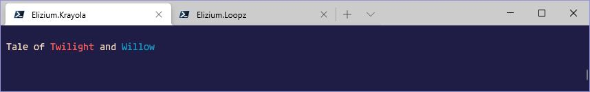

# :rainbow: Elizium.Krayola Classes

## Scribbler :snail: vs Krayon :smiley_cat:

The [Scribbler](#Scribbler-Class) and the [Krayon](#Krayon-Class) work together in rendering coloured output via the host. The Krayon is the instance that invokes *Write-Host*. It is furnished with a variety of methods (as illustrated below) that enable it to do so and with accordance to a provided Krayola theme, that helps the client produce output in a consistent manner across different commands.

However, it soon became apparent that allowing the client to have a direct dependency on the Krayon prevented any means of controlling the output, ie in unit testcases, it would be desirable not to generate any, so as to keep test case output as quiet as possible. The Scribbler was subsequently built to provide this level of control which it does via an internal buffer implemented with a *StringBuilder*. The method that would be called on Krayon is now implemented on the Scribbler which it handles by appending to the buffer. The client can build up output with successive calls and at any time of the client's choosing, the Scribbler can be *Flush*ed, at which point those buffered instructions are replayed on the Krayon via its own *Scribble* method.

The original intended usage of the Krayon would go something like this:

```powershell
  $krayon.Reset().Text('Tale of ').Red().Text('Twilight').Reset().Text(' and ').Blue().Text('Willow').End();
```

This results in the following being written to the console:



Alternatively, the client could create what is called a *structured* string containing embedded colour instructions and scribble that content via the Scribble/ScribbleLn method, eg:

```powershell
  [string]$structured = 'Tale of &[red] Twilight &[reset] and &[blue]Willow';
  $krayon.ScribbleLn($structured).End();
```

Note in both of these examples, method calls on the Krayon are chained together, this is known as *Fluent* and is a common object oriented programming paradigm.

The controlling aspect comes at construction time. The client creates and Scribbler/Krayon via factory functions *[New-Scribbler](Elizium.Krayola/docs/New-Scribbler.md)/[New-Krayon](Elizium.Krayola/docs/New-Krayon.md)*. (Actually, the use of New-Krayon is optional as the Krayon is defaulted away in New-Scribbler). Depending on the Flags specified on New-Scribbler and the presence of the environment variable *EliziumTest* a *QuietScribbler* could be created instead of a regular Scribbler. The QuietScribbler behaves like its regular counterpart except that it overrides the Flush method so that the Krayon is not invoked, hence no output.

Now with the Scribbler in play, the client can do either of the follow:

```powershell
  $scribbler.Reset().Text('Tale of the ').Red().Text('Twilight').Reset().Text(' and ').Blue().Text('Willow').End();
```

or

```powershell
  [string]$structured = 'Tale of the &[red] Twilight &[reset] and &[blue]Willow&[Ln]';
  $scribbler.Scribble($structured);
```

In both of the these examples, the Scribbler will just buffer these instructions up inside an internal StringBuilder and only when the Flush method is called, Scribbler passes the buffered content to Krayon which it interprets as a structured string and invokes host writes accordingly. In the former example, the method calls such as *red* and *blue* in this example are called *accelerators*, because as soon as you call that Scribbler method, the content goes straight into the buffer, where as in the latter example, the user has to build up a structured string and then pass it into the scribble method. This is largely a style choice, one is not better than the other.

:warning: The latter example shown above may seem to be more readable. However it should be noted that

+ the '&', '[' and ']' are not the default delimiter tokens used (they are in fact 'µ', '«' and '»' respectively). It was soon found that it would be much better if the tokens used were not tokens easily accessed via the keyboard and regularly used because of regular expression parsing and how this could be interfered with if the client actually wanted to see these tokens in the output in a different context (eg trying to display '\[something\]' when '[' and a ']' are used to parse colour instructions broke regular expression matching).

+ If the client for some reason needed to see in the output, what are now the default tokens 'µ', '«' and '»' in a different context and therefore prefer to change these defaults, they can do so by using a custom regular expression and formatters (see [New-Krayon](Elizium.Krayola/docs/New-Krayon.md)); ie the *Literal* style. If we stick to not directly using these tokens in our structured strings (non literal *Structured* style) and use the [utility](#Scribbler-utility-methods) methods on the Scribbler, we can avoid huge refactors if these patterns/formatters have to change at a later date (that is not to say there are any plans to change the defaults in Krayola).

But even though it is recommended to not directly use delimiter tokens inside structured strings it is understandable for readability reasons why a client may wish to do so.

The follow code snippets illustrate the contrasting styles of Accelerated vs Structured vs Literal:

### Accelerated

:sparkles: Accelerated style:

```powershell
  [Scribbler]$scribbler = New-Scribbler;

  $scribbler.Reset().
    Text('Tale of').
    Red().Text(' Twilight ').
    Reset().
    Text('and ').
    Blue().Text('Willow').
    Ln().End();

  $scribbler.Flush();
```

### Structured

:sparkles: Structured style:

```powershell
  [Scribbler]$scribbler = New-Scribbler;

  [string]$redSnippet = $scribbler.Snippets(@('red'));
  [string]$blueSnippet = $scribbler.Snippets(@('blue'));
  [string]$lnSnippet = $scribbler.Snippets(@('Ln'));
  [string]$resetSnippet = $scribbler.Snippets(@('Reset'));

  $scribbler.Scribble(
    "$($resetSnippet)Tale of$($redSnippet) Twilight " +
    "$($resetSnippet)and $($blueSnippet)Willow$($lnSnippet)"
  );

  $scribbler.Flush();
```

### Literal

:sparkles: Structured Literal style:

```powershell
  [Scribbler]$scribbler = New-Scribbler;

  $scribbler.Scribble(
    "µ«Reset»Tale ofµ«Red» Twilight " +
    "µ«Reset»and µ«Blue»Willowµ«Ln»"
  );

  $scribbler.Flush();
```

The following tables shows the methods that are defined on both of these classes. The Scribbler is a wrapper around the Krayon, so most of the methods on the Krayon are replicated in the Scribbler.

*Legend*:

+ :heavy_check_mark:: class contains methods (links to description)
+ :x:: class does not contain those methods
+ :heavy_plus_sign:: the methods defined are fluent (they return the instance so that method calls can be chained together)

### Scribblers

| Method Name   | Scribbler           | Krayon
|---------------|---------------------|------------------------------------------------
| [Scribble](#Scribbler.Scribble) | [:heavy_check_mark:](#%23Scribbler.Scribble) | [:heavy_check_mark:](#Krayon.Scribble([string]$source)) :heavy_plus_sign:
| ScribbleLn    | :x:                 | [:heavy_check_mark:](#Krayon.ScribbleLn([string]$source)) :heavy_plus_sign:

### Text

| Method Name   | Scribbler           | Krayon
|---------------|---------------------|------------------------------------------------
| Text          | [:heavy_check_mark:](#Scribbler.Text([string]$value)) :heavy_plus_sign: | [:heavy_check_mark:](#Krayon.Text([string]$value)) :heavy_plus_sign:
| TextLn        | [:heavy_check_mark:](#Scribbler.TextLn([string]$value)) :heavy_plus_sign: | [:heavy_check_mark:](#Krayon.TextLn([string]$value)) :heavy_plus_sign:

### Pair

| Method Name   | Scribbler           | Krayon
|---------------|---------------------|------------------------------------------------
| Pair          | [:heavy_check_mark:](#Scribbler.Pair([couplet]$couplet)) :heavy_plus_sign: | [:heavy_check_mark:](#Krayon.Pair([couplet]$couplet)) :heavy_plus_sign:
| PairLn        | [:heavy_check_mark:](#Scribbler.PairLn([couplet]$couplet)) :heavy_plus_sign: | [:heavy_check_mark:](#Krayon.PairLn([couplet]$couplet)) :heavy_plus_sign:

### Line

| Method Name   | Scribbler           | Krayon
|---------------|---------------------|------------------------------------------------
| Line          | [:heavy_check_mark:](#Scribbler.Line([line]$line)) :heavy_plus_sign: | [:heavy_check_mark:](#Krayon.Line([line]$line)) :heavy_plus_sign:
| NakedLine     | [:heavy_check_mark:](#Scribbler.NakedLine([line]$nakedLine)) :heavy_plus_sign: | [:heavy_check_mark:](#Krayon.NakedLine([line]$nakedLine)) :heavy_plus_sign:

### Message

| Method Name          | Scribbler           | Krayon
|----------------------|---------------------|-----------------------------------------
| Message              | [:heavy_check_mark:](#Scribbler.Message([string]$message)) :heavy_plus_sign: | [:heavy_check_mark:](#Krayon.Message([string]$message)) :heavy_plus_sign:
| MessageLn            | [:heavy_check_mark:](#Scribbler.MessageLn([string]$message)) :heavy_plus_sign: | [:heavy_check_mark:](#Krayon.MessageLn([string]$message)) :heavy_plus_sign:
| MessageNoSuffix      | [:heavy_check_mark:](#Scribbler.MessageNoSuffix([string]$message)) :heavy_plus_sign: | [:heavy_check_mark:](#Krayon.MessageNoSuffix([string]$message)) :heavy_plus_sign:
| MessageNoSuffixLn    | [:heavy_check_mark:](#Scribbler.MessageNoSuffixLn([string]$message)) :heavy_plus_sign: | [:heavy_check_mark:](#Krayon.MessageNoSuffixLn([string]$message)) :heavy_plus_sign:

### Foreground/Background

| Method Name    | Scribbler           | Krayon
|----------------|---------------------|-----------------------------------------------
| fore           | [:heavy_check_mark:](#Scribbler.fore([string]$colour)) :heavy_plus_sign: | [:heavy_check_mark:](#Krayon.fore([string]$colour)) :heavy_plus_sign:
| back           | [:heavy_check_mark:](#Scribbler.back([string]$colour)) :heavy_plus_sign: | [:heavy_check_mark:](#Krayon.back([string]$colour)) :heavy_plus_sign:
| defaultFore    | [:heavy_check_mark:](#Scribbler.defaultFore([string]$colour)) :heavy_plus_sign: | [:heavy_check_mark:](#Krayon.defaultFore([string]$colour)) :heavy_plus_sign:
| defaultBack    | [:heavy_check_mark:](#Scribbler.defaultBack([string]$colour)) :heavy_plus_sign: | [:heavy_check_mark:](#Krayon.defaultBack([string]$colour)) :heavy_plus_sign:
| getDefaultFore | :x:                 | [:heavy_check_mark:](#Krayon.getDefaultFore())
| getDefaultBack | :x:                 | [:heavy_check_mark:](#Krayon.getDefaultBack())

### Control

| Method Name   | Scribbler           | Krayon
|---------------|---------------------|------------------------------------------------
| End           | [:heavy_check_mark:](#Scribbler.End()) | [:heavy_check_mark:](#Krayon.End())
| Flush         | [:heavy_check_mark:](#Scribbler.Flush()) | :x:
| Ln            | [:heavy_check_mark:](#Scribbler.Ln()) :heavy_plus_sign: | [:heavy_check_mark:](#Krayon.Ln()) :heavy_plus_sign:
| Reset         | [:heavy_check_mark:](#Scribbler.Reset()) :heavy_plus_sign: | [:heavy_check_mark:](#Scribbler.Reset()) :heavy_plus_sign:
| Restart       | [:heavy_check_mark:](#Scribbler.Restart()) | :x:
| Save          | [:heavy_check_mark:](#Scribbler.Save([string]$fullPath)) | :x:

### Theme

| Method Name   | Scribbler           | Krayon
|---------------|---------------------|------------------------------------------------
| ThemeColour   | [:heavy_check_mark:](#Scribbler.ThemeColour([string]$val)) :heavy_plus_sign: | [:heavy_check_mark:](#Krayon.ThemeColour([string]$val)) :heavy_plus_sign:

### Static Colours

All the static colour methods are of identical form, so for brevity, the following table
only shows the methods for 'blue' and its background counterpart.

| Method Name    | Scribbler           | Krayon
|----------------|---------------------|-----------------------------------------------
| blue           | [:heavy_check_mark:](#Scribbler.\<Colour\>()) :heavy_plus_sign: | [:heavy_check_mark:](#Krayon.\<Colour\>()) :heavy_plus_sign:
| bgBlue         | [:heavy_check_mark:](#Scribbler.\<Colour\>()) :heavy_plus_sign: | [:heavy_check_mark:](#Krayon.\<Colour\>()) :heavy_plus_sign:

### Compounders (CSV/semi-colonSV)

| Method Name   | Scribbler           | Krayon
|---------------|---------------------|------------------------------------------------
| Line          | :x:                 | [:heavy_check_mark:](#Krayon.Line([line]$line)) :heavy_plus_sign:
| NakedLine     | :x:                 | [:heavy_check_mark:](#Krayon.NakedLine([line]$nakedLine)) :heavy_plus_sign:
| Pair          | :x:                 | [:heavy_check_mark:](#Krayon.Pair([couplet]$couplet)) :heavy_plus_sign:
| PairLn        | :x:                 | [:heavy_check_mark:](#Krayon.PairLn([couplet]$couplet)) :heavy_plus_sign:

### Utility

| Method Name     | Scribbler           | Krayon
|-----------------|---------------------|------------------------------------------------
| Snippets        | [:heavy_check_mark:](#Scribbler.Snippets([string[]]$items))  | :x:
| WithArgSnippet  | [:heavy_check_mark:](#Scribbler.WithArgSnippet([string]$api,[string]$arg))  | :x:
| PairSnippet     | [:heavy_check_mark:](#Scribbler.PairSnippet([couplet]$pair))  | :x:
| LineSnippet     | [:heavy_check_mark:](#Scribbler.LineSnippet([line]$line))  | :x:

## Scribbler Class

Generally, the user should only interact with the Scribbler class, not the Krayon. The Scribbler can handle a whole chunk of structured content via the *Scribble* method or individually via the accelerator methods. Generally, the client provides a payload (eg a pair instance or a line instance) and the Scribbler will serialise into a string and store in the buffer. The Krayon, upon request, needs to de-serialise the structured content and replay the action methods upon itself.

The code examples in this section include a *Flush* invoke. It is at this point that the content in the Scribbler's buffer is replayed on the Krayon resulting in the output seen in the console.

### Scribbler Scribble methods

+ Scribble

#### Scribbler.Scribble

:gem: Scribbler.Scribble([string]$source)

*source* is a structured string, which means it contains colouring instructions and core text. The structured string is buffered **without** a new line.

```powershell
  [string]$redSnippet = $scribbler.Snippets(@('red'));
  [string]$blueSnippet = $scribbler.Snippets(@('blue'));
  [string]$lnSnippet = $scribbler.Snippets(@('Ln'));
  [string]$resetSnippet = $scribbler.Snippets(@('Reset'));

  $scribbler.Scribble(
    "$($lnSnippet)$($lnSnippet)" +
    "$($resetSnippet)Tale of$($redSnippet) Twilight " +
    "$($resetSnippet)and $($blueSnippet)Willow$($lnSnippet)$($lnSnippet)$($lnSnippet)$($lnSnippet)"
  );

  $scribbler.Flush();
```

### Scribbler Text methods

:dart: Text/TextLn

#### Scribbler.Text([string]$value)

*value* is a plain string fragment, which means it contains no colouring instructions, just core text.

The text string value is buffered **without** a new line.

```powershell
  $scribbler.Reset().
    Text('Tale of').
    Red().Text(' Twilight ').
    Reset().
    Text('and ').
    Blue().Text('Willow').
    Ln().End();

  $scribbler.Flush();
```

#### Scribbler.TextLn([string]$value)

*value* is a plain string fragment, which means it contains no colouring instructions, just core text.

The text string value is buffered **with** a new line.

```powershell
  $scribbler.Reset().
    TextLn('Tale of').
    Red().Text(' Twilight ').
    Reset().
    TextLn('and ').
    Blue().TextLn('Willow').
    Ln().End();

  $scribbler.Flush();
```

### Scribbler Pair methods

:dart: Pair/PairLn (see the [Couplet](#Couplet-Class) Class)

#### Scribbler.Pair([couplet]$couplet)

*couplet* is a 'couplet' instance representing an optionally 'affirmed' key/value pair. A couplet's affirmed status is determined by the client and indicates if the value should be rendered using the Krayola theme's *AFFIRM-COLOURS*.

Buffers the pair couplet **without** a new line.

```powershell
  [couplet]$pair = New-Pair @('Gift', 'For Her Light');
  $scribbler.Pair($pair).End();
  $scribbler.Flush();
```

#### Scribbler.PairLn([couplet]$couplet)

*couplet* is a 'couplet' instance representing an optionally 'affirmed' key/value pair. A couplet's affirmed status is determined by the client and indicates if the value should be rendered using the Krayola theme's *AFFIRM-COLOURS*.

Buffers the pair couplet **with** a new line.

```powershell
  [couplet]$pair = New-Pair @('Gift', 'For Her Light');
  $scribbler.PairLn($pair).End();
  $scribbler.Flush();
```

#### Scribbler.Pair([PSCustomObject]$couplet)

*couplet* is a 'PSCustomObject' instance which must have *Key* and *Value* properties representing an optionally *affirmed* boolean member. A couplet's affirmed status is determined by the client and indicates if the value should be rendered using the Krayola theme's *AFFIRM-COLOURS*.

Buffers the pair object **with** a new line.

```powershell
  [PSCustomObject]$pairObj = [PSCustomObject]@{
    Key = 'Gift';
    Value = 'Ex';
    Affirm = $true;
  }
  $scribbler.Pair($pairObj).End();
  $scribbler.Flush();
```

#### Scribbler.PairLn([PSCustomObject]$couplet)

*couplet* is a 'PSCustomObject' instance which must have *Key* and *Value* properties representing an optionally *affirmed* boolean member. A couplet's affirmed status is determined by the client and indicates if the value should be rendered using the Krayola theme's *AFFIRM-COLOURS*.

Buffers the pair object **without** a new line.

```powershell
  [PSCustomObject]$pairObj = [PSCustomObject]@{
    Key = 'Gift';
    Value = 'Closer';
  }
  $scribbler.PairLn($pairObj).Ln().End();
  $scribbler.Flush();
```

### Scribbler Line methods

:dart: Line/NakedLine (see the [Line](#Line-Class) Class)

#### Scribbler.Line([line]$line)

*line* is a 'Line' instance which is a collection of 'couplet's.

The Line method has a new line built into it.

```powershell
  [line]$line = $(New-Line(@(
        $(New-Pair('What is the answer to life, love and unity', 'Fourty Two'))
      )));

  $scribbler.Line($line).End();
  $scribbler.Flush();
```

#### Scribbler.NakedLine([line]$nakedLine)

*nakedLine* is a 'Line' instance which is a collection of 'couplet's. The Line method has a new line built into it. The Line method is defined in terms of the Krayola Theme. The collection of pairs that comprises the line are 'book-ended' by the tokens defined in the Krayola theme under the 'OPEN' and 'CLOSE' keys. A naked line is one that is rendered without the 'OPEN' and 'CLOSE' tokens.

The NakedLine method has a new line built into it.

```powershell
  [line]$line = $(New-Line(@(
        $(New-Pair('Naked', 'The Emperor has no clothes'))
      )));

  $scribbler.NakedLine($line).End();
  $scribbler.Flush();
```

#### Scribbler.Line([string]$message, [line]$line)

*message* is some text that is displayed just prior to the line.

*line* is a 'Line' instance which is a collection of 'couplet's.

When *message* is present, the text defined in the Krayola theme under key 'MESSAGE-SUFFIX' is displayed immediately after the message and preceding the line's couplets.

The Line method has a new line built into it.

```powershell
  [string]$message = 'Greetings Happy Scripters';
  [line]$line = $(New-Line(@(
        $(New-Pair('Liquid Refreshment', 'Milk')),
        $(New-Pair('Biscuit Refreshment', 'Cookies'))
      )));

  $scribbler.Line($message, $line).End();
  $scribbler.Flush();
```

#### Scribbler.NakedLine([string]$message, [line]$line)

*message* is some text that is displayed just prior to the line.

*line* is a 'Line' instance which is a collection of 'couplet's.

The NakedLine method is defined in terms of the Krayola Theme. The collection of pairs that comprises the line are 'book-ended' by the tokens defined in the Krayola theme under the 'OPEN' and 'CLOSE' keys. A naked line is one that is rendered without the 'OPEN' and 'CLOSE' tokens. When *message* is present, the text defined in the Krayola theme under key 'MESSAGE-SUFFIX' is displayed immediately after the message and preceding the line's couplets.

The NakedLine method has a new line built into it.

```powershell
  [string]$message = 'Greetings Earthlings';
  [line]$line = $(New-Line(@(
        $(New-Pair('Treat', 'Recycled Plastik')),
        $(New-Pair('Treat', 'Musik'))
      )));

  $scribbler.NakedLine($message, $line).End();
  $scribbler.Flush();
```

### Scribbler Message methods

:dart: Message/MessageLn/MessageNoSuffix/MessageNoSuffixLn

All these methods are displayed using the colour defined in the Krayola theme under key 'MESSAGE-COLOURS'.

#### Scribbler.Message([string]$message)

*message* is some text that precedes static text defined in the Krayola theme under key 'MESSAGE-SUFFIX'. 

Buffers the message **without** a new line.

```powershell
  $scribbler.Message('... in a bottle').End();
  $scribbler.Flush();
```

#### Scribbler.MessageLn([string]$message)

*message* is some text that precedes static text defined in the Krayola theme under key 'MESSAGE-SUFFIX'. 

Buffers the message **with** a new line.

```powershell
  $scribbler.MessageLn('The World Is My Oyster').End();
  $scribbler.Flush();
```

#### Scribbler.MessageNoSuffix([string]$message)

*message* is some text.

The *NoSuffix* version displays the line without static text defined in the Krayola theme under key 'MESSAGE-SUFFIX'.

Buffers the message **without** a new line.

```powershell
  $scribbler.MessageNoSuffix('The Only Star In Heaven').End();
  $scribbler.Flush();
```

#### Scribbler.MessageNoSuffixLn([string]$message)

*message* is some text.

The *NoSuffix* version displays the line without static text defined in the Krayola theme under key 'MESSAGE-SUFFIX'.

Buffers the message **with** a new line.

```powershell
  $scribbler.MessageNoSuffixLn('Black Night White Light').End();
  $scribbler.Flush();
```

### Scribbler Dynamic Colour methods

:dart: fore/back/defaultFore/defaultBack

#### Scribbler.fore([string]$colour)

*colour* is a standard console colour as defined in PowerShell. It enables the client to set the foreground colour with a variable. Any text written after the colour has been invoked appears in this foreground colour. The colour remains in place until changed by another foreground colour or a *Reset* has been invoked returning the colour state back to the default.

Buffers the foreground colour.

```powershell
  [System.ConsoleColor]$colour = 'cyan';
  $scribbler.fore($colour).Text('[Rainbow Islands]').End();
  $scribbler.Flush();
```

#### Scribbler.back([string]$colour)

*colour* is a standard console colour as defined in PowerShell. It enables the client to set the background colour with a variable. Any text written after the colour has been invoked appears in this background colour. The colour remains in place until changed by another background colour or a *Reset* has been invoked returning the colour state back to the default.

Buffers the background colour.

:warning: The colour for the background is just the regular console colour, not the alternative colour defined for the background eg 'bgRed', which can be invoked explicitly on the Scribbler or Krayon.

```powershell
  [System.ConsoleColor]$colour = 'cyan';
  $scribbler.back($colour).Text('[Island Rainbows]').End();
  $scribbler.Flush();
```

#### Scribbler.defaultFore([string]$colour)

*colour* is a standard console colour as defined in PowerShell. It enables the client to set the default foreground colour with a variable. The default colour is the colour that the Krayon returns to as a result of *Reset* having been invoked.

Buffers the default foreground colour.

```powershell
  $scribbler.defaultFore('red').Reset().TextLn('Hell Fire').End();
  $scribbler.Flush();
```

#### Scribbler.defaultBack([string]$colour)

*colour* is a standard console colour as defined in PowerShell. It enables the client to set the default background colour with a variable. The default colour is the colour that the Krayon returns to as a result of *Reset* having been invoked.

Buffers the default background colour.

:warning: The colour for the background is just the regular console colour, not the alternative colour defined for the background eg 'bgRed', which can be invoked explicitly on the Scribbler or Krayon.

```powershell
  $scribbler.defaultBack('blue').Reset().TextLn('The Walls Of Jericho').End();
  $scribbler.Flush();
```

### Scribbler Control methods

:dart: End/Flush/Ln/Reset/Restart/Save

#### Scribbler.End()

When invoking the *fluent* methods, within a function context, it is necessary to consume the return value. If the result in not consumed, then its value can be leaked out into the console. Most if not always, this is not what the client would expect. Therefore, when the end of an invoke chain has been reached, then the client should either call the *End()* method or can they use any other standard powershell technique for consuming/re-directing un-consumed values, like assigning to *$null* or re-directing to *out-null*. The *End* method was provided as a convenience. You will notice that in all the examples shown, the *End* method is being invoked.

#### Scribbler.Flush()

Causes the buffered content inside the Scribbler to be replayed on the Krayon. The exception to this is when a Quiet scribbler is in play as a result of being run in a Testing context without *EliziumTest* being present in the environment. This ensures that by default, test cases using the Scribbler either directly or indirectly are noise-less. Of course the client can define test cases with the Scribbler mocked out which is also another recommended technique (actually mocking out classes in Powershell testcases is difficult, if not impossible). However, sometimes its good to see test cases running showing real output (in *integration tests*), that is why this design choice was taken.

#### Scribbler.Ln()

Buffers a new line operation.

#### Scribbler.Reset()

Buffers a request to return the Krayon to default foreground and background colours.

#### Scribbler.Restart()

Similar to Reset, but also clears internal buffers. Akin to a *HardReset*.

#### Scribbler.Save([string]$fullPath)

*fullPath* is the full path to a non-existent file to which the session content is written out to.

When the Scribbler has been created with the *Save* option, any *Flush* invokes that occur cause the current buffer to be copied over to another *session* buffer. The client, at the end of its batch run can invoke the *Save* method and content is written to the specified file. If the file already exists, an error is reported and content not saved. This feature allows a *replay* facility where another command can read the saved content and replay it to the console as though the original command had run again.

### Scribbler Theme methods

:dart: ThemeColour

#### Scribbler.ThemeColour([string]$val)

*val* is a string that specifies a Krayola theme colour. The krayola theme contains the following colour entries:

+ AFFIRM-COLOURS ('affirm')
+ KEY-COLOURS ('key')
+ MESSAGE-COLOURS ('message')
+ META-COLOURS ('meta')
+ VALUE-COLOURS ('value')

The value inside the brackets denotes the valid string for the $val parameter that corresponds to the Theme colour being invoked. Specifying a theme colour is the same as if you'd specified an explicit colour, eg when *red* is invoked, it sets the current foreground to 'red'. This allows the client to write in colours according to the Krayola theme.

```powershell
  $scribbler.ThemeColour('Affirm').TextLn("That's all folks").End();
  $scribbler.Flush();
```

### Scribbler Static Colour methods

:dart: \<colour\>/bg\<colour\>

#### Scribbler.\<Colour\>()

Sets either the foreground or background colour. The background colours are specified by preceding the standard colour name with 'bg', eg 'bgCyan'. Sends the colour request into the buffer.

### Scribbler utility methods

:dart: Snippets/WithArgSnippet/PairSnippet/LineSnippet

#### Scribbler.Snippets([string[]]$items)

*$items* a collection of strings representing Krayon method invokes.

Given an array of string instructions, returns structured representation. Each instruction must map to any method on the Krayon that takes no parameters.

```powershell
  $scribbler.Snippets(@('Reset', 'Ln', 'Ln'));
```

Returns the structured string:

> µ«Reset»µ«Ln»µ«Ln»

#### Scribbler.WithArgSnippet([string]$api,[string]$arg)

*api* the single parameter Krayon method to invoke.

*arg* the parameter to invoke method represented by *api*, with.

A single invoke of *WithArgSnippet* represents a single invoke only. The api must be a Krayon method that takes a single parameter. The snippet created is formulated using *WriterFormatWithArg* parameter passed into *New-Krayon* factory function. The default value is "µ«{0},{1}»". ({0} represents the api call and {1} represents that parameter passed into *api*). Invoking this function returns a snippet of structured content that represents the api call with a single parameter.

```powershell
  [string]$message = '*** Love under will';
  [string]$resetSnippet = $scribbler.Snippets(@('Reset'));
  [string]$lnSnippet = $scribbler.Snippets(@('Ln'));
  [string]$messageSnippet = $scribbler.WithArgSnippet('Message', $message);

  $scribbler.Scribble(
    "$($resetSnippet)$($messageSnippet)$($lnSnippet)"
  );
  $scribbler.Flush();
```

#### Scribbler.PairSnippet([couplet]$pair)

*couplet* is a 'couplet' instance representing an optionally 'affirmed' key/value pair. A couplet's affirmed status is determined by the client and indicates if the value should be rendered using the Krayola theme's *AFFIRM-COLOURS*.

This method is automatically invoked when the client uses the *Pair* accelerator method. However, if the client is building up [structured content](#Structured), they may use this function to create a snippet representing a pair. Invoking this function returns a snippet of structured content that represents a key/value optionally affirmed pair.

```powershell
  [couplet]$pair = $(New-Pair @('two', 'Never Forget'));
  [string]$pairSnippet = $scribbler.PairSnippet($pair);
  [string]$lnSnippet = $scribbler.Snippets(@('Ln'));

  $scribbler.Scribble("$($pairSnippet)$($lnSnippet)");

  $scribbler.Flush();
```

:pushpin: If the key or value either contains a comma or semi-colon, then these are automatically escaped. This allows the pair to be represented as a compounded string value so that it can be scribbled on the Krayon.

#### Scribbler.LineSnippet([line]$line)

*line* is a 'Line' instance which is a collection of 'couplet's. The Line method has a new line built into it.

This method is automatically invoked when the client uses the *Line* accelerator method. However, if the client is building up [structured content](#Structured), they may use this function to create a snippet representing a line. If the client wants to represent a line with an additional message the semi-colon/csv value (a compound string) constructed must be of the form (do not include the angle brackets):

> "\<message>;\<pair-1>;\<pair-2>;...\<pair-n>;"

where each pair is a csv value (a compound value representing a pair):

> "\<key-1>,\<value-1>,\<affirm>"

(affirm can be 'true' or 'false')

On seeing the first leg of the *Line* compound string, which may represent a message or pair, Krayon will check to see if there is no comma present. If there is no comma present, it will be taken as the message. The *Line* method with the message overload will be invoked in this scenario. If the first leg contains a comma, then it will be treated the same as all other legs and the *Line* overload without the message parameter is invoked instead. Any legs not properly formatted will cause an error. This is why it's recommended to use this *LineSnippet* helper function, which guarantees correct formatting and escaping.

```powershell
  [couplet]$pair = $(New-Pair @('one', 'Doubleplusgood'));
  [line]$line = New-Line(@($pair));
  [string]$lineSnippet = $scribbler.LineSnippet($line);

  $scribbler.Scribble("$($lineSnippet)");

  $scribbler.Flush();
```

:pushpin: If the key or value either contains a comma or semi-colon, then these are automatically escaped. This allows the pair to represented as a compounded string value so that it can be scribbled on the Krayon.

## Krayon Class

The workhorse that performs the actual writes to the console.

### Krayon Scribble methods

:dart: Scribble/ScribbleLn

#### Krayon.Scribble([string]$source)

*source* is a structured string, which means it contains colouring instructions and core text. The *source* is replayed on the Krayon, ultimately writing payload text to the host console.

Structured content is written to the host WITHOUT a new line.

#### Krayon.ScribbleLn([string]$source)

*source* is a structured string, which means it contains colouring instructions and core text. The *source* is replayed on the Krayon, ultimately writing payload text to the host console with an additional new line.

### Krayon Text methods

:dart: Text/TextLn

#### Krayon.Text([string]$value)

*value* is a plain string fragment, which means it contains no colouring instructions but just core text.

The text value is written using the current foreground and background colours. The text is written to the console **without** a new line. This allows colours to be changed at will on the current line.

#### Krayon.TextLn([string]$value)

*value* is a plain string fragment, which means it contains no colouring instructions but just core text.

The text value is written using the current foreground and background colours **with** a new line. The text is written to the console WITHOUT a line feed. This allows colours to be changed at will on the current line.

### Krayon Pair methods

:dart: Pair/PairLn

#### Krayon.Pair([couplet]$couplet)

*couplet* is a 'couplet' instance representing an optionally 'affirmed' key/value pair. A couplet's affirmed status is determined by the client and indicates if the value should be rendered using the Krayola theme's *AFFIRM-COLOURS*.

Writes the couplet instance to the console using the colours and formatting defined in the Krayola theme **without** a new line.

#### Krayon.PairLn([couplet]$couplet)

*couplet* is a 'couplet' instance representing an optionally 'affirmed' key/value pair. A couplet's affirmed status is determined by the client and indicates if the value should be rendered using the Krayola theme's *AFFIRM-COLOURS*.

Writes the couplet instance to the console using the colours and formatting defined in the Krayola theme **with** a new line.

#### Krayon.Pair([PSCustomObject]$couplet)

*couplet* is a 'PSCustomObject' instance which must have *Key* and *Value* properties representing an optionally *affirmed* boolean member. A couplet's affirmed status is determined by the client and indicates if the value should be rendered using the Krayola theme's *AFFIRM-COLOURS*.

Writes the couplet instance to the console using the colours and formatting defined in the Krayola theme **without** a new line.

#### Krayon.PairLn([PSCustomObject]$couplet)

*couplet* is a 'PSCustomObject' instance which must have *Key* and *Value* properties representing an optionally *affirmed* boolean member. A couplet's affirmed status is determined by the client and indicates if the value should be rendered using the Krayola theme's *AFFIRM-COLOURS*.

Writes the couplet instance to the console using the colours and formatting defined in the Krayola theme **with** a new line.

### Krayon Line methods

:dart: Line/NakedLine

#### Krayon.Line([line]$line)

*line* is a 'Line' instance which is a collection of 'couplet's. The Line method has a new line built into it.

Writes the line instance to the console using the colours and formatting defined in the Krayola theme **with** a new line.

#### Krayon.NakedLine([line]$nakedLine)

*nakedLine* is a 'Line' instance which is a collection of 'couplet's. The Line method has a new line built into it. The Line method is defined in terms of the Krayola Theme. The collection of pairs that comprises the line are 'book-ended' by the tokens defined in the Krayola theme under the 'OPEN' and 'CLOSE' keys. A naked line is one that is rendered without the 'OPEN' and 'CLOSE' tokens.

Writes the naked line to the console using the colours and formatting defined in the Krayola theme **with** a new line.

#### Krayon.Line([string]$message, [line]$line)

*message* is some text that is displayed just prior to the line.

*line* is a 'Line' instance which is a collection of 'couplet's. The Line method has a new line built into it. When *message* is present, the text defined in the Krayola theme under key 'MESSAGE-SUFFIX' is displayed immediately after the message and preceding the line's couplets.

Writes the message line instance to the console using the colours and formatting defined in the Krayola theme **with** a new line.

#### Krayon.NakedLine([string]$message, [line]$line)

*message* is some text that is displayed just prior to the line.

*nakedLine* is a 'Line' instance which is a collection of 'couplet's. The Line method has a new line built into it. The Line method is defined in terms of the Krayola Theme. The collection of pairs that comprises the line are 'book-ended' by the tokens defined in the Krayola theme under the 'OPEN' and 'CLOSE' keys. A naked line is one that is rendered without the 'OPEN' and 'CLOSE' tokens.

Writes the message and the naked line to the console using the colours and formatting defined in the Krayola theme **with** a new line.

### Krayon Message methods

:dart: Message/MessageLn/MessageNoSuffix/MessageNoSuffixLn

#### Krayon.Message([string]$message)

*message* is some text that precedes static text defined in the Krayola theme under key 'MESSAGE-SUFFIX'.

Writes the message to the console using the colours and formatting defined in the Krayola theme **with** a new line.

#### Krayon.MessageLn([string]$message)

*message* is some text that precedes static text defined in the Krayola theme under key 'MESSAGE-SUFFIX'.

Writes the message to the console using the colours and formatting defined in the Krayola theme **with** a new line.

#### Krayon.MessageNoSuffix([string]$message)

*message* is some text. The *NoSuffix* version displays the line without static text defined in the Krayola theme under key 'MESSAGE-SUFFIX'.

Writes the message to the console using the colours and formatting defined in the Krayola theme **without** a new line.

#### Krayon.MessageNoSuffixLn([string]$message)

*message* is some text. The *NoSuffix* version displays the line without static text defined in the Krayola theme under key 'MESSAGE-SUFFIX'.

Writes the message to the console using the colours and formatting defined in the Krayola theme **with** a new line.

### Krayon Dynamic Colour methods

:dart: fore/back/defaultFore/defaultBack/getDefaultFore/getDefaultBack

#### Krayon.fore([string]$colour)

*colour* is a standard console colour as defined in PowerShell. It enables the client to set the foreground colour with a variable. Any text written after the colour has been invoked appears in this foreground colour. The colour remains in place until changed by another foreground colour or a *Reset* has been invoked returning the colour state back to the default.

Set the current foreground colour.

#### Krayon.back([string]$colour)

*colour* is a standard console colour as defined in PowerShell. It enables the client to set the background colour with a variable. Any text written after the colour has been invoked appears in this background colour. The colour remains in place until changed by another background colour or a *Reset* has been invoked returning the colour state back to the default.

Set the current background colour.

#### Krayon.defaultFore([string]$colour)

*colour* is a standard console colour as defined in PowerShell. It enables the client to set the default foreground colour with a variable. The default colour is the colour that the Krayon returns to as a result of *Reset* having been invoked.

Set the default foreground colour.

#### Krayon.defaultBack([string]$colour)

*colour* is a standard console colour as defined in PowerShell. It enables the client to set the default background colour with a variable. The default colour is the colour that the Krayon returns to as a result of *Reset* having been invoked.

Set the default background colour.

#### Krayon.getDefaultFore()

Gets the default foreground colour. Does not affect current state of the Krayon.

#### Krayon.getDefaultBack()

Gets the default background colour. Does not affect current state of the Krayon.

### Krayon Control methods

:dart: End/Ln/Reset

#### Krayon.End()

See [Scribbler.End()](#Scribbler.End())

#### Krayon.Ln()

Writes a new line to the console.

#### Krayon.Reset()

Resets the current foreground and background colours back to their defaults.

### Krayon Theme methods

:dart: ThemeColour

#### Krayon.ThemeColour([string]$val)

See [Scribbler.ThemeColour()](#Scribbler.ThemeColour())

### Krayon Static Colour methods

:dart: Static Colours

__standard colours:__ 'black', 'darkBlue', 'darkGreen', 'darkCyan',
'darkRed', 'darkMagenta', 'darkYellow', 'gray', 'darkGray', 'blue', 'green',
'cyan', 'red', 'magenta', 'yellow', 'white'

__background colours:__ 'bgBlack', 'bgDarkBlue', 'bgDarkGreen', 'bgDarkCyan',
'bgDarkRed', 'bgDarkMagenta', 'bgDarkYellow', 'bgGray', 'bgDarkGray', 'bgBlue', 'bgGreen',
'bgCyan', 'bgRed', 'bgMagenta', 'bgYellow', 'bgWhite'

#### Krayon.\<Colour\>()

Sets either the foreground or background colour.

### Krayon Compounders methods

:dart: Line/NakedLine/Pair/PairLn

Krayon supports the invocation of its methods via Scribble for its parameter less or single parameter methods only. Some of the methods that take a single parameter represent compound values. These compounder functions are helpers that coerce a compound value into a singular string value, so that the corresponding method can be invoked correctly.

These compounder functions do not need to be called by the client. They form part of the interface between Krayon and Scribbler. As the client invokes methods on the Scribbler, the Scribbler needs to buffer these requests prior to a *Flush* request that will occur at some point in the future. The buffering requires that the request is stored as a string, therefore the original value needs to be converted into string form. The Krayon needs to be able to interpret these string representations, which is the function that these compounders perform.

#### Krayon.Line([string]$semiColonSV)

*semiColonSV* is a semi-colon separated string value, where each leg represents a single couplet. The sub-string representing a couplet, is itself a comma separated value and can contain either 2 or 3 elements. Because the user might need to use a comma or semi-colon inside key or value values, they need to be escaped. This is already done automatically inside the Scribbler.Line method.

A *Line* is a compound value, comprised of multiple (compound value) *couplet*s. This method extracts the embedded Line instance and invokes the Line method on the Krayon, generating the corresponding output in the console. The Line method has a new line built into it.

#### Krayon.NakedLine([string]$semiColonSV)

*semiColonSV* is a semi-colon separated string value, where each leg represents a single couplet. The sub-string representing a couplet, is itself a comma separated value and can contain either 2 or 3 elements.
Because the user might need to use a comma or semi-colon inside key or value values, they need to be escaped. This is already done automatically inside the Scribbler.NakedLine method.

*NakedLine* is a 'Line' instance which is a collection (compound value) of 'couplet's. The Line method has a new line built into it. The Line method is defined in terms of the Krayola Theme. The collection of pairs that comprises the line are 'book-ended' by the tokens defined in the Krayola theme under the 'OPEN' and 'CLOSE' keys. A naked line is one that is rendered without the 'OPEN' and 'CLOSE' tokens. The NakedLine method has a new line built into it.

#### Krayon.Pair([string]$csv)

*csv* is a comma separated string value and can contain either 2 or 3 elements, the Key, Value and an optional Affirm.

Pair is a compound value that is represented as a CSV and is represented on Krayon as the invocation of the Pair method, at which point Krayon renders the Pair in the console using the colours and formats defined in the Krayola theme.

#### Krayon.PairLn([string]$csv)

Same as its [Pair](#Krayon.Pair([string]$csv)) equivalent except a new line is appended.

### Krayon Utility methods

:dart: Native

#### Krayon.Native([string]$structured)

*structured* represents a blob of structured content.

This method uses the regular expression that it was created with in order to extract the core content returning the full core text without the api calls and associated parameters. This is generally not needed but can be useful for assisting with unit-testing.

## Couplet Class

This represents a key/value pair with an optional Affirm boolean value. A couplet's affirmed status is determined by the client and indicates if the value should be rendered using the Krayola theme's *AFFIRM-COLOURS*.

See [New-Pair](Elizium.Krayola/docs/New-Pair.md).

## Line Class

This represents a collection of 'couplet's. The line methods on the Scribbler and Krayon have a new line built into their semantics.

See [New-Line](Elizium.Krayola/docs/New-Line.md).
