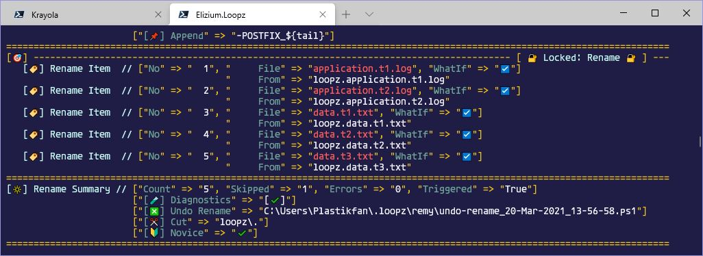

# :rainbow: Elizium.Krayola

[](https://commonflow.org)
[](https://git-scm.com/book/en/v2/Git-Branching-Rebasing)
[](https://github.com/eliziumnet/krayola/blob/master/LICENSE)
[](https://www.powershellgallery.com/packages/Elizium.Krayola)

Colourful console writing with PowerShell

:warning: A lot of the documentation here is now out of date, it will be updated in due course and work is currently taking place to produce more comprehensive documentation at github pages. Also, the write in colour functions are now deprecated. The new write functionality is implemented in the Scribbler and Krayon objects; information coming ...

## Table of contents

[Introduction](#Introduction)

+ [Provide sequence of colour described key/value pairs](#Provide-sequence-of-colour-described-key/value-pairs)
+ [Provide a theme describing how key/value pairs should be rendered](#Provide-a-theme-describing-how-key/value-pairs-should-be-rendered)

[Using The API](#Using-the-API)

+ [The Theme parameter](#The-Theme-parameter)
  + [The Public API](#The-Public-API)
    + [Helper function Get-IsKrayolaLightTerminal](#Helper-function-Get-IsKrayolaLightTerminal)
    + [Helper function Get-KrayolaTheme](#Helper-function-Get-KrayolaTheme)
    + [Helper function Show-ConsoleColours](#Helper-function-Show-ConsoleColours)

  + [Invalid Theme](#Invalid-Theme)
  + [Global pre-defined Themes](#Global-pre-defined-Themes)

[Trouble shooting](#Trouble-shooting)

## Introduction

The module can be installed using the standard **install-module** command:

> PS> install-module -Name Elizium.Krayola

Krayola provides the capability to write consistent and colourful PowerShell console applications. The key here is that it produces structured output according to user defined formats. A point of note that should be noted by powershell developers is that generally commands should not write to the console. This is for various reasons including (but not limited to)

+ PowerShell can be run a wide variety of scenarios and not all are interactive and makes no assumption about the host. That host may or may not be a console and commands should not assume the presence of one.
+ commands should be designed to be flexible to enable easy re-use, so if a command is writing to the host, it maybe not be easy to use it from other commands where output could interfere with their own operation.

However, bearing the above points in mind, some commands are designed specifically for a console (because they are ui commands) and in this circumstance, writing to the console is fine. There are other other writer functions (eg Write-Information/Write-Debug etc) can be used, but none of these are able to write in colours controlled by the client. Krayola can be used to assist in writing colourful output in a structured manner in accordance with a user definable theme: the 'Krayola Theme'.

## Using the API

### The Main Commands

| COMMAND-NAME                                                                     | DESCRIPTION
|----------------------------------------------------------------------------------|------------
| [Get-KrayolaTheme](Elizium.Loopz/docs/Get-KrayolaTheme.md)                       | Gets Krayola theme
| [New-Krayon](Elizium.Loopz/docs/New-Krayon.md)                                   | Krayon factory
| [New-Line](Elizium.Loopz/docs/New-Line.md)                                       | Line factory
| [New-Pair](Elizium.Loopz/docs/New-Pair.md)                                       | Pair factory
| [New-Scribbler](Elizium.Loopz/docs/New-Scribbler.md)                             | Scribbler factory

### Classes

| COMMAND-NAME
|-----------------------------------------------------
| [Couplet](Elizium.Loopz/docs/classes.md)
| [Krayon](Elizium.Loopz/docs/classes.md)
| [Line](Elizium.Loopz/docs/classes.md)
| [Scribbler](Elizium.Loopz/docs/classes.md)
| [QuietScribbler](Elizium.Loopz/docs/classes.md)

#### A tale of the :tulip: Scribbler/Krayon vs the :wilted_flower: Legacy functions

Once upon a time, The Krayola PowerShell module came into being. Upon creation, 3 colour writing functions were built. They were known as *Write-In-Colour*, *Write-RawPairsInColour* and *Write-ThemedPairsInColour*. Now for a time, the creator was able to write brand new commands using these functions and all was well.

The commands produced such colourful :rainbow: displays, that word began to spread among the local towns :cityscape: folk :family:. More and more of the locals caught the scripting bug :bug: and were :smiley: happy to create scripts that both delighted and marvelled their friends :elf: and neighbours :genie:.

One day, a busy little unicorn :unicorn: by the name of Twilight started to find it difficult writing colourful scripts :scroll: quickly. 'Why oh why do I constantly get array indexing errors' lamented Twilight. 'Well, ...' replied her friend Willow :duck:, 'you must always remember to use the comma operator when dealing with single item arrays'. 'But I do', cried Twilight. Willow tried to ease her despair :unamused:, 'There, there. Fear not, we all make mistakes from time to time, nobody is perfect. Actually, I know what you mean. Sometimes, I trip over and see those pesky error messages, particularly when creating multi-dimensional arrays, but those functions we use are all we have.' :frowning:.

Twilight, thought for a while and asked 'Well how about, we go back to the creator and asked if there were another way we could write in colour'. Willow replied, 'you know what, that may just do the job. We could go and visit the creator bearing gifts of *Musik* :notes: and poetry' :mortar_board:. Twilight heartily :revolving_hearts: agreed, 'Ok let's make haste so we can get back in time before the Setting Sun'. Willow enquired, 'Oh, what a way with words you have. Setting sun? What on :globe_with_meridians: *Earth Inferno* :fire: do you mean?'. Twilight apologised, 'Oh sorry about that, my passion for 1990's techno music sometimes gets the better of me and I just can't resist an obscure reference. *The Setting Sun* is a song by a pair of Brothers of the Chemical variety that once exited the planet dust.'. Willow, retorted 'Come on now, let's not waste any more time. You pick up that 'Recycled Plastik' over there, and I'll bring 'From My Mind To Yours', I'm sure that fan of Plastik will appreciate both of those delights.

So off they trotted. After a treading a long and winding road, they eventually found the creator. "Rat-a-tat-a-tat", sounded the door as they knocked to alert him of their plea :pray:. The door opened and they were warmly welcomed into his abode. After a round a milk and cookies, Willow and Twilight stated their case.

With sympathy, the creator explained, 'I wrote those functions in haste and I too encountered the issues of which you tell. Do you know what? You are in luck. Let me introduce you to my 2 new friends :blush: :upside_down_face:'. As though pulling rabbits :rabbit: out of a hat, the creator waved his hand in a gesture of good will and out popped 2 shiny new classes named *Scribbler* :snail: and *Krayon* :smiley_cat:.

'Wow', gasped Twilight and Willow. Twilight piped up 'I very much like your 2 new friends'. Willow agreed and added, 'Krayon, seems a little shy and appears to be hiding behind Scribbler. Is he ok?'. The creator, detected the slight concern expressed by his visitors and assuaged them, 'Yeah, he's fine, in fact he's more than fine. He's very happy to help you with your colouring tasks, but all he asks is for you to speak with his younger sister Scribbler'.

Twilight and Willow glanced at each other simultaneously and high-fived :thumbsup:. Scribbler chimed in, 'Whenever you need some colour, come to me and I will help. Krayon and myself make a great team. Just tell me the colours you want your text in and I'll collect them them all up in a little bag called *StringBuilder*. You can *Flush* me at any time, and I'll chat with Krayon and he'll make play with the Host. And if you like, I can be quiet too. I know you like to write unit tests for your scripts, but the software engineering gods advise that tests should be quick and noise-less. Just let me know by either waving the 'Test' flag :triangular_flag_on_post: or the 'Silent' flag :checkered_flag:. And you also need to know, if you wave the Test flag, I will be quiet unless I find 'EliziumTest' :test_tube: in the environment. So your wish is my command'.

'Wowzer, Willow, today has been great', cried Twilight. 'Too right, now we don't ever have to get bogged down with those pesky little array indexing errors and can avoid those trouble-some multi-dimensional arrays. I generally don't have a problem with multi-dimensional arrays, but in PowerShell, they really do make my head itch! :thinking:'.

And finally, the creator thanked them for their gifts :sunglasses: and replied in kind, 'I'm so pleased you brought me that 'Recycled Plastik', may all my good vibes and well wishes go 'From My Mind To Yours'. Do yourself a favour and branch out a little. This is a bit off beat and some say an acquired taste, but you ought to check out :four: :woman_with_veil: :sparkles: '*For Her Light*' as he handed them a copy of *Earth Inferno*. 'Enjoy! Oh and don't forget, those old functions are deprecated so use them no more, they are destined for the realms of the Underworld :skull:, long live Scribbler and Krayon'

The happy scripters left the creator with a skip in their step and joy in their hearts :gift_heart:.

... and they all lived happily ever after :joy:.

### Supporting Utilities

| COMMAND-NAME                                                                     | DESCRIPTION
|----------------------------------------------------------------------------------|------------
| [Get-DefaultHostUiColours](Elizium.Loopz/docs/Get-DefaultHostUiColours.md)       | Get default host colours
| [Get-EnvironmentVariable](Elizium.Loopz/docs/Get-EnvironmentVariable.md)         | Get variable from Env
| [Get-IsKrayolaLightTerminal](Elizium.Loopz/docs/Get-IsKrayolaLightTerminal.md)   | Has user declare light theme
| [Show-ConsoleColours](Elizium.Loopz/docs/Show-ConsoleColours.md)                 | Show console colours

### Deprecated

:warning: No longer supported and will be removed; use the Scribbler instead.

| COMMAND-NAME                                                                     | DESCRIPTION
|----------------------------------------------------------------------------------|------------
| [Write-InColour](Elizium.Loopz/docs/Write-InColour.md)                           | DEPRECATED
| [Write-RawPairsInColour](Elizium.Loopz/docs/Write-RawPairsInColour.md)           | DEPRECATED
| [Write-ThemedPairsInColour](Elizium.Loopz/docs/Write-ThemedPairsInColour.md)     | DEPRECATED

### The Krayola Theme

This is just a hash table, which must contain the following items:

| KEY-NAME           | TYPE     | DESCRIPTION
| -----------------  | ---------| -----------
| FORMAT             | string   | A string containing a placeholder for the Key and the Value. It represents how the whole key/value pair should be represented. It must contain the KEY-PLACE-HOLDER and VALUE-PLACE-HOLDER strings.
| KEY-PLACE-HOLDER   | string   | The place holder that identifies the Key in the FORMAT string.
| VALUE-PLACE-HOLDER | string   | The place holder that identifies the Value in the FORMAT string.
| KEY-COLOURS        | string[] | Array of 1 or 2 items only, the first is the foreground colour and the optional second value is the background colour, that specifies how Keys are displayed
| VALUE-COLOURS      | string[] | The same as KEY-COLOURS but it applies to Values
| AFFIRM-COLOURS     | string[] | The highlight colour applied to affirmed Values
| OPEN               | string   | Specifies the leading wrapper around the whole key/value pair collection, typically '('
| CLOSE              | string   | Specifies the tail wrapper around the whole key/value pair collection typically ')'
| SEPARATOR          | string   | Specifies a sequence of characters that separates the Key/Vale pairs, typically ','
| META-COLOURS       | string[] | Meta characters include OPEN, CLOSE, SEPARATOR and any other character in the FORMAT which is not the KEY or VALUE
| MESSAGE-COLOURS    | string[] | The colours that describe the optional message that appears preceding the Key/Value pair collection.
| MESSAGE-SUFFIX     | string   | Specifies a sequence of characters that separates the MESSAGE (if present) from the Key/Value pair collection.

An example Theme is as follows:

```powershell
$ExampleTheme = @{
  "FORMAT"             = "'<%KEY%>'='<%VALUE%>'";
  "KEY-PLACE-HOLDER"   = "<%KEY%>";
  "VALUE-PLACE-HOLDER" = "<%VALUE%>";
  "KEY-COLOURS"        = @("DarkCyan");
  "VALUE-COLOURS"      = @("White");
  "OPEN"               = "[";
  "CLOSE"              = "]";
  "SEPARATOR"          = ", ";
  "AFFIRM-COLOURS"     = @("Red");
  "META-COLOURS"       = @("Yellow");
  "MESSAGE-COLOURS"    = @("Cyan");
  "MESSAGE-SUFFIX"     = " // "
}
```

:warning: Note that the tokens <%KEY%> and <%VALUE%> are also defined inside the FORMAT. You will see an error if the FORMAT does not contain these place holders.

The Krayola theme in the above example is illustrated in the following image:



### The Public API

+ Format
+ KeyPlaceHolder (This MUST be present in Format)
+ ValuePlaceHolder (This MUST be present in Format)
+ Open
+ Close
+ Separator
+ MetaColours
+ Message: (Optional) The textual message to be displayed preceding the Key/Value pair collection
+ MessageColours
+ MessageSuffix

```powershell
$ExampleTheme = @{
  "FORMAT"             = "'<%KEY%>'='<%VALUE%>'";
  "KEY-PLACE-HOLDER"   = "<%KEY%>";
  "VALUE-PLACE-HOLDER" = "<%VALUE%>";
  "KEY-COLOURS"        = @("Red");
  "VALUE-COLOURS"      = @("Blue");
  "AFFIRM-COLOURS"     = @("Yellow");
  "OPEN"               = "{";
  "CLOSE"              = "}";
  "SEPARATOR"          = " | ";
  "META-COLOURS"       = @("Cyan");
  "MESSAGE-COLOURS"    = @("DarkRed", "White");
  "MESSAGE-SUFFIX"     = " // "
}
```

The above would display as follows:

> {'Artist'='Plastikman' | 'Song'='Marbles'}

and with a custom message:

#### Helper function Get-IsKrayolaLightTerminal

Gets the value of the environment variable *KRAYOLA_LIGHT_TERMINAL* as a boolean.

For use by applications that need to use a Krayola theme that is dependent on whether a light or dark background colour is in effect in the current terminal.

#### Helper function Get-KrayolaTheme

Helper function that makes it easier for client applications to get a Krayola theme from the environment, which is compatible with the terminal colours being used. This helps keep output from different applications consistent.

The parameters:

+ KrayolaThemeName (optional)

If $KrayolaThemeName is specified, then it is used to lookup the theme in the global $KrayolaThemes hash table exposed by the Krayola module. If either the theme specified does not exist or not specified, then a default theme is used. The default theme created should be compatible with the dark/lightness of the background of the terminal currently in use. By default, a dark terminal is assumed and the colours used show up clearly against a dark background. If *KRAYOLA_LIGHT_TERMINAL* is defined as an environment variable (can be set to any string apart from empty string/white space), then the colours chosen show up best against a light background.

#### Helper function Show-ConsoleColours

The module exports a function *Show-ConsoleColours* that simply displays all the available console colours as they are represented in text in the colour they represent. This will aid in defining custom themes. Just invoke the function with no arguments in your PowerShell session.

### Invalid Theme

If an invalid Theme is passed into *Write-ThemedPairsInColour*, (eg, 1 of the elements is missing) then it will revert to using an alternative 'emergency theme'.

Eg

```powershell
$InvalidTheme = @{}
$PairsToWrite = @(@("Sport", "Tennis"), @("Star", "Elena Dementieva"))
Write-ThemedPairsInColour -Pairs $PairsToWrite -Theme $InvalidTheme
```

is displayed as:

> 💩💩💩  💥 ('Sport'='Tennis'👻 'Star'='Elena Dementieva')

### Global pre-defined Themes

The module exports a global variable *$KrayolaThemes* hash-table, which contains some predefined themes. The user can use one of these (currently defined as "EMERGENCY-THEME", "ROUND-THEME", "SQUARE-THEME" and "ANGULAR-THEME"). This list may be added to in the future. *$KrayolaThemes*, is not a read only variable, so if the client requires, they can add their own.

For example:

```powershell
Write-ThemedPairsInColour -Pairs $PairsToWrite -Theme $KrayolaThemes["SQUARE-THEME"]
```

## Trouble shooting

The following a description of some of the pitfalls that I encountered writing this module mainly due to the esoteric implementation of arrays in PowerShell, that I hope can be avoided by others.
