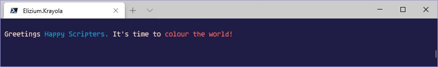

<!-- MarkDownLint-disable no-inline-html -->
<!-- MarkDownLint-disable no-emphasis-as-heading -->
# :rainbow: Elizium.Krayola

[](https://commonflow.org)
[](https://git-scm.com/book/en/v2/Git-Branching-Rebasing)
[](https://github.com/eliziumnet/krayola/blob/master/LICENSE)
[](https://www.powershellgallery.com/packages/Elizium.Krayola)

Colourful console writing with PowerShell

## Table of contents

+ [Introduction](#Introduction)
+ [Quick Start](#Quick-Start)
+ [Using The API](#Using-the-API)
+ [The Main Commands](#The-Main-Commands)
  + [Krayola Theme](#Krayola-Theme)
    + [Using The Krayola Theme](#Using-The-Krayola-Theme)
    + [function Get-KrayolaTheme](#function-Get-KrayolaTheme)
    + [Classes](#Classes)
      + [A tale of the Scribbler/Krayon vs the Legacy functions](#A-tale-of-the-Scribbler\/Krayon-vs-the-Legacy-functions)
  + [Supporting Utilities](#Supporting-Utilities)
    + [Deprecated](#Deprecated)
    + [Helper functions](#Helper-functions)
      + [function Get-DefaultHostUiColours](#function-Get-DefaultHostUiColours)
      + [function Get-EnvironmentVariable](#function-Get-EnvironmentVariable)
      + [function Get-IsKrayolaLightTerminal](#function-Get-IsKrayolaLightTerminal)
      + [function Show-ConsoleColours](#function-Show-ConsoleColours)
    + [Global pre-defined Themes](#Global-pre-defined-Themes)
+ [Developer Notes](#Developer-Notes)
  + [Running build tasks](#Running-build-tasks)
  + [Problem rebuilding modified classes in the same PowerShell session](#Problem-rebuilding-modified-classes-in-the-same-PowerShell-session)

## Introduction

The module can be installed using the standard **install-module** command:

> PS> install-module -Name Elizium.Krayola

Krayola provides the capability to write consistent and colourful PowerShell console applications. The key here is that it produces structured output according to user defined formats. A point of note that should be noted by powershell developers is that generally commands should not write to the console. This is for various reasons including (but not limited to)

+ PowerShell can be run a wide variety of scenarios and not all are interactive and makes no assumption about the host. That host may or may not be a console and commands should not assume the presence of one.
+ commands should be designed to be flexible to enable easy re-use, so if a command is writing to the host, it maybe not be easy to use it from other commands where output could interfere with their own operation.

However, bearing the above points in mind, some commands are designed specifically for a console (because they are ui commands) and in this circumstance, writing to the console is fine. There are other other writer functions (eg Write-Information/Write-Debug etc) can be used, but none of these are able to write in colours controlled by the client. Krayola can be used to assist in writing colourful output in a structured manner in accordance with a user definable theme: the 'Krayola Theme'.

## Quick Start <a name="quick-start"></a>

+ Create a Scribbler instance using the [New-Scribbler](Elizium.Krayola/docs/New-Scribbler.md) factory function:

```powershell
  [Scribbler]$scribbler = New-Scribbler
```

This creates the object the client needs to begin writing coloured content. It uses the default Krayola theme and a default Krayon.

+ Next queue up some content:

```powershell
  $scribbler.Text('Greetings ').Blue().Text('Happy Scripters. ').Reset().Text("It's time to ").Red().Text('colour the world!').Ln().End();
```

+ Now flush the buffer, so content is displayed:

```powershell
  $scribbler.Flush();
```

The above code results in the following output:

<a name = "quick-start-colour-the-world"></a>



All the standard console colours are supported. The background colour can be set, by prepending 'bg' to the standard colour name eg:

> $scribbler.bgBlue().Text('Oceans apart ...')

This sets the background colour to blue, then writes 'Oceans apart ...' with the background set to blue.

More formatted content can be displayed using methods such as [Pair](Elizium.Krayola/docs/classes.md#scribbler.pair) or a [Line](Elizium.Krayola/docs/classes.md#scribbler.line)

## Using the API

### The Main Commands

| COMMAND-NAME                                                                     | DESCRIPTION
|----------------------------------------------------------------------------------|------------
| [Get-KrayolaTheme](Elizium.Krayola/docs/Get-KrayolaTheme.md)                       | Gets Krayola theme
| [New-Krayon](Elizium.Krayola/docs/New-Krayon.md)                                   | Krayon factory
| [New-Line](Elizium.Krayola/docs/New-Line.md)                                       | Line factory
| [New-Pair](Elizium.Krayola/docs/New-Pair.md)                                       | Pair factory
| [New-Scribbler](Elizium.Krayola/docs/New-Scribbler.md)                             | Scribbler factory

### Krayola Theme<a name="krayola-theme"></a>

#### Using The Krayola Theme

This is just a hash table, which must contain the following items:

| KEY-NAME           | TYPE     | DESCRIPTION
| -----------------  | ---------| -----------
| FORMAT             | string   | A string containing a placeholder for the Key and the Value. It represents how the whole key/value pair should be represented. It must contain the KEY-PLACE-HOLDER and VALUE-PLACE-HOLDER strings.
| KEY-PLACE-HOLDER   | string   | The place holder that identifies the Key in the FORMAT string.
| VALUE-PLACE-HOLDER | string   | The place holder that identifies the Value in the FORMAT string.
| KEY-COLOURS        | string[] | Array of 1 or 2 items only, the first is the foreground colour and the optional second value is the background colour, that specifies how Keys are displayed
| VALUE-COLOURS      | string[] | The same as KEY-COLOURS but it applies to Values
| AFFIRM-COLOURS     | string[] | The highlight colour applied to affirmed Values
| OPEN               | string   | Specifies the leading wrapper around the whole key/value pair collection, typically '('
| CLOSE              | string   | Specifies the tail wrapper around the whole key/value pair collection typically ')'
| SEPARATOR          | string   | Specifies a sequence of characters that separates the Key/Vale pairs, typically ','
| META-COLOURS       | string[] | Meta characters include OPEN, CLOSE, SEPARATOR and any other character in the FORMAT which is not the KEY or VALUE
| MESSAGE-COLOURS    | string[] | The colours that describe the optional message that appears preceding the Key/Value pair collection.
| MESSAGE-SUFFIX     | string   | Specifies a sequence of characters that separates the MESSAGE (if present) from the Key/Value pair collection.

An example Theme is as follows:

```powershell
$ExampleTheme = @{
  "FORMAT"             = "'<%KEY%>'='<%VALUE%>'";
  "KEY-PLACE-HOLDER"   = "<%KEY%>";
  "VALUE-PLACE-HOLDER" = "<%VALUE%>";
  "KEY-COLOURS"        = @("DarkCyan");
  "VALUE-COLOURS"      = @("White");
  "OPEN"               = "[";
  "CLOSE"              = "]";
  "SEPARATOR"          = ", ";
  "AFFIRM-COLOURS"     = @("Red");
  "META-COLOURS"       = @("Yellow");
  "MESSAGE-COLOURS"    = @("Cyan");
  "MESSAGE-SUFFIX"     = " // "
}
```

:warning: Note that the tokens <%KEY%> and <%VALUE%> are also defined inside the FORMAT. You will see an error if the FORMAT does not contain these place holders.

The Krayola theme in the above example is illustrated in the following image:

<a name = "example-krayola-theme-illustration"></a>


#### function Get-KrayolaTheme

:sparkles: [Helper function Get-KrayolaTheme](Elizium.Krayola/docs/Get-KrayolaTheme.md)

Helper function that makes it easier for client applications to get a Krayola theme from the environment, which is compatible with the terminal colours being used. This helps keep output from different applications consistent.

The parameters:

+ KrayolaThemeName (optional)

If $KrayolaThemeName is specified, then it is used to lookup the theme in the global $KrayolaThemes hash table exposed by the Krayola module. If either the theme specified does not exist or not specified, then a default theme is used. The default theme created should be compatible with the dark/lightness of the background of the terminal currently in use. By default, a dark terminal is assumed and the colours used show up clearly against a dark background. If *KRAYOLA_LIGHT_TERMINAL* is defined as an environment variable (can be set to any string apart from empty string/white space), then the colours chosen show up best against a light background.

### Classes

:sparkles: See [Classes](Elizium.Krayola/docs/classes.md)

| COMMAND-NAME
|-----------------------------------------------------
| [Couplet](Elizium.Krayola/docs/classes.md#Couplet-Class)
| [Krayon](Elizium.Krayola/docs/classes.md#Krayon-Class)
| [Line](Elizium.Krayola/docs/classes.md#Line-Class)
| [Scribbler](Elizium.Krayola/docs/classes.md#Scribbler-Class)

#### A tale of the Scribbler/Krayon vs the Legacy functions<a name="classes.tale-of-scribbler-krayon"></a>

*A tale of the :tulip: Scribbler/Krayon vs the :wilted_flower: Legacy functions*

Once upon a time, The Krayola PowerShell module came into being. Upon creation, 3 colour writing functions were built. They were known as *Write-In-Colour*, *Write-RawPairsInColour* and *Write-ThemedPairsInColour*. Now for a time, the creator was able to write brand new commands using these functions and all was well.

The commands produced such colourful :rainbow: displays, that word began to spread among the local towns :cityscape: folk :family:. More and more of the locals caught the scripting bug :bug: and were :smiley: happy to create scripts that both delighted and marvelled their friends :elf: and neighbours :genie:.

One day, a busy little unicorn :unicorn: by the name of Twilight started to find it difficult writing colourful scripts :scroll: quickly. 'Why oh why do I constantly get array indexing errors' lamented Twilight. 'Well, ...' replied her friend Willow :duck:, 'you must always remember to use the comma operator when dealing with single item arrays'. 'But I do', cried Twilight. Willow tried to ease her despair :unamused:, 'There, there. Fear not, we all make mistakes from time to time, nobody is perfect. Actually, I know what you mean. Sometimes, I trip over and see those pesky error messages, particularly when creating multi-dimensional arrays, but those functions we use are all we have.' :frowning:.

Twilight, thought for a while and asked 'Well how about, we go back to the creator and asked if there were another way we could write in colour'. Willow replied, 'you know what, that may just do the job. We could go and visit the creator bearing gifts of [*Musik*](https://www.discogs.com/Plastikman-Musik/master/37381) :notes: and poetry' :mortar_board:. Twilight heartily :revolving_hearts: agreed, 'Ok let's make haste so we can get back in time before the Setting Sun'. Willow enquired, 'Oh, what a way with words you have. [*The Setting sun*](https://www.discogs.com/The-Chemical-Brothers-Setting-Sun/release/13341)? What on :globe_with_meridians: [*Earth Inferno*](https://www.discogs.com/Fields-Of-The-Nephilim-Earth-Inferno/master/323) :fire: do you mean?'. Twilight apologised, 'Oh sorry about that, my passion for 1990's techno music and goth rock sometimes gets the better of me and I just can't resist an obscure reference. *The Setting Sun* is a song by a pair of [Brothers](https://www.discogs.com/artist/2290-The-Chemical-Brothers) of the Chemical variety that once exited the [planet dust](https://www.discogs.com/The-Chemical-Brothers-Exit-Planet-Dust/master/23493) and *Earth Inferno* is probably the best live album of all time.'. Willow, retorted 'Come on now, let's not waste any more time. You pick up that ['Recycled Plastik'](https://www.discogs.com/Plastikman-Recycled-Plastik/master/37404) over there, and I'll bring ['From My Mind To Yours'](https://www.discogs.com/label/936837-From-My-Mind-To-Yours), I'm sure that fan of Plastik will appreciate both of those delights.

So off they trotted. After treading a long and winding road, they eventually found the creator. "Rat-a-tat-a-tat", sounded the door as they knocked to alert him of their plea :pray:. The door opened and they were warmly welcomed into his abode. After a round a milk and cookies, Willow and Twilight stated their case.

With sympathy, the creator explained, 'I wrote those functions in haste and I too encountered the issues of which you tell. Do you know what? You are in luck. Let me introduce you to my 2 new friends :blush: :upside_down_face:'. As though pulling rabbits :rabbit: out of a hat, the creator waved his hand in a gesture of good will and out popped 2 shiny new classes named *Scribbler* :snail: and *Krayon* :smiley_cat:.

'Wow', gasped Twilight and Willow. Twilight piped up 'I very much like your 2 new friends'. Willow agreed and added, 'Krayon, seems a little shy and appears to be hiding behind Scribbler. Is he ok?'. The creator, detected the slight concern expressed by his visitors and assuaged them, 'Yeah, he's fine, in fact he's more than fine. He's very happy to help you with your colouring tasks, but all he asks is for you to speak with his younger sister Scribbler'.

Twilight and Willow glanced at each other simultaneously and high-fived :thumbsup:. Scribbler chimed in, 'Whenever you need some colour, come to me and I will help. Krayon and myself make a great team. Just tell me the colours you want your text in and I'll collect them all up in a little bag called [*StringBuilder*](https://docs.microsoft.com/en-us/dotnet/api/system.text.stringbuilder?view=net-5.0). You can [*Flush*]() me at any time, and I'll chat with Krayon and he'll make play with the Host. And if you like, I can be quiet too. I know you like to write unit tests for your scripts, but the software engineering gods advise that tests should be quick and noise-less. Just let me know by either waving the 'Test' flag :triangular_flag_on_post: or the 'Silent' flag :checkered_flag:. And you also need to know, if you wave the Test flag, I will be quiet unless I find 'EliziumTest' :test_tube: in the environment. So your wish is my command'.

'Wowzer, Willow, today has been great', cried Twilight. 'Too right, now we don't ever have to get bogged down with those pesky little array indexing errors and can avoid those trouble-some multi-dimensional arrays. I generally don't have a problem with multi-dimensional arrays, but in PowerShell, they really do make my head itch! :thinking:'.

And finally, the creator thanked them for their gifts :sunglasses: and replied in kind, 'I'm so pleased you brought me that 'Recycled Plastik', may all my good vibes and well wishes go 'From My Mind To Yours'. Do yourself a favour and branch out a little. This is a bit off beat and some say an acquired taste, but you ought to check out :four: :princess: :sparkles: ['*For Her Light*'](https://www.discogs.com/Fields-Of-The-Nephilim-For-Her-Light/release/493477) as he handed them a copy of *Earth Inferno*. 'Enjoy! Oh and don't forget, those old functions are deprecated so use them no more, they are destined for the realms of the Underworld :skull:, long live Scribbler and Krayon'; 'Hoorah!!'. They all cried.

The happy scripters left the creator with a skip in their step and joy in their hearts :gift_heart:.

... and they all lived happily ever after :joy:.

And now back to reality.

#### :snail: Scribbler vs :smiley_cat: Krayon

Both the [*Scribbler*](#main.scribbler) and [*Krayon*](#main.krayon) have a similar fluent api, as illustrated in the table below. (PS, the :heavy_check_mark:'s are hyperlinks)

<a name="sk.table"></a>
| method                            | Scribbler                           | Krayon                              | Description
|-----------------------------------|-------------------------------------|-------------------------------------|-------------
| ___Scribblers___                  | :heavy_minus_sign:                  | :heavy_minus_sign:                  | :heavy_minus_sign:
| Scribble [string]                 | [:heavy_check_mark:](#s.scribble)   | [:heavy_check_mark:](#k.scribble)   | Write a structured string
| ___Text___                        | :heavy_minus_sign:                  | :heavy_minus_sign:                  | :heavy_minus_sign:
| Text [string]                     | :x:                                 | [:heavy_check_mark:](#k.text)       | Write piece of text in current colours
| TextLn [string]                   | :x:                                 | [:heavy_check_mark:](#k.textln)     | Write piece of text with a new line in current colours
| ___Pair___                        | :heavy_minus_sign:                  | :heavy_minus_sign:                  | :heavy_minus_sign:
| Pair [couplet]                    | [:heavy_check_mark:](#s.pair.1)     | [:heavy_check_mark:](#k.pair.1)     | Write key/value pair in format defined by Krayola Theme
| PairLn [couplet]                  | [:heavy_check_mark:](#s.pairln.1)   | [:heavy_check_mark:](#k.pairln.1)   | Write key/value pair with a new line in format defined by Krayola Theme
| Pair [PSCustomObject]             | [:heavy_check_mark:](#s.pair.2)     | [:heavy_check_mark:](#k.pair.2)     | Write PSCustomObject key/value pair in format defined by Krayola Theme
| PairLn [PSCustomObject]           | [:heavy_check_mark:](#s.pairln.2)   | [:heavy_check_mark:](#k.pairln.2)   | Write PSCustomObject key/value pair with a new line in format defined by Krayola Theme
| ___Line___                        | :heavy_minus_sign:                  | :heavy_minus_sign:                  | :heavy_minus_sign:
| Line [line]                       | [:heavy_check_mark:](#s.line.1)     | [:heavy_check_mark:](#k.line.1)     | Write a collection of pairs expressed as a line instance in format defined by Krayola Theme
| NakedLine [line]                  | [:heavy_check_mark:](#s.nkd-line.1) | [:heavy_check_mark:](#k.nkd-line.1) | Write a collection of pairs expressed as a naked line instance in format defined by Krayola Theme
| Line [string], [line]             | [:heavy_check_mark:](#s.line.2)     | [:heavy_check_mark:](#k.line.2)     | Write a collection of pairs expressed as a line instance in format defined by Krayola Theme, with a preceding message
| NakedLine [string], [line]        | [:heavy_check_mark:](#s.nkd-line.2) | [:heavy_check_mark:](#k.nkd-line.2) | Write a collection of pairs expressed as a naked line instance in format defined by Krayola Theme, with a preceding message
| ___Message___                     | :heavy_minus_sign:                  | :heavy_minus_sign:                  | :heavy_minus_sign:
| Message [string]                  | [:heavy_check_mark:](#s.message)    | [:heavy_check_mark:](#k.message)    | Write piece of text in colours defined by Krayola Theme ('MESSAGE-COLOURS')
| MessageLn [string]                | [:heavy_check_mark:](#s.messageln)  | [:heavy_check_mark:](#k.messageln)  | Write piece of text with a new line in colours defined by Krayola Theme ('MESSAGE-COLOURS')
| MessageNoSuffix [string]          | [:heavy_check_mark:](#s.message-no-suffix) | [:heavy_check_mark:](#k.message-no-suffix) | Write piece of text in colours defined by Krayola Theme ('MESSAGE-COLOURS'), without the suffix
| MessageNoSuffixLn [string]        | [:heavy_check_mark:](#s.message-no-suffixln) | [:heavy_check_mark:](#k.message-no-suffixln) | Write piece of text with a new line in colours defined by Krayola Theme ('MESSAGE-COLOURS'), without the suffix
| ___Dynamic Colours___             | :heavy_minus_sign:                  | :heavy_minus_sign:                  | :heavy_minus_sign:
| fore [string]                     | [:heavy_check_mark:](#s.fore)       | [:heavy_check_mark:](#k.fore)       | Set the current foreground colour
| back [string]                     | [:heavy_check_mark:](#s.back)       | [:heavy_check_mark:](#k.back)       | Set the current background colour
| defaultFore [string]              | [:heavy_check_mark:](#s.def-fore)   | [:heavy_check_mark:](#k.def-fore)   | Set the default foreground colour
| defaultBack [string]              | [:heavy_check_mark:](#s.def-back)   | [:heavy_check_mark:](#k.def-back)   | Set the default background colour
| getDefaultFore                    | :x:                                 | [:heavy_check_mark:](#k.get-def-fore) | Get the default foreground colour
| getDefaultBack                    | :x:                                 | [:heavy_check_mark:](#k.get-def-back) | Get the default background colour
| ___Static Colours___              | :heavy_minus_sign:                  | :heavy_minus_sign:                  | :heavy_minus_sign:
| \<colour>                         | [:heavy_check_mark:](#s.colour)     | [:heavy_check_mark:](#k.colour)     | Set the current foreground literal colour
| bg\<colour>                       | [:heavy_check_mark:](#s.back-colour) | [:heavy_check_mark:](#k.back-colour) | Set the current background literal colour
| ___Control___                     | :heavy_minus_sign:                  | :heavy_minus_sign:                  | :heavy_minus_sign:
| End                               | :x:                                 | [:heavy_check_mark:](#k.end)        | Ends the current fluent call chain
| Ln                                | [:heavy_check_mark:](#s.ln)         | [:heavy_check_mark:](#k.ln)         | Issue a carriage return
| Reset                             | [:heavy_check_mark:](#s.reset)      | [:heavy_check_mark:](#k.reset)      | Reset foreground and background colours back to defaults
| Flush                             | [:heavy_check_mark:](#s.flush)      | :x:                                 | Apply the contents of buffer onto Krayon and clear the buffer
| ___Theme___                       | :heavy_minus_sign:                  | :heavy_minus_sign:                  | :heavy_minus_sign:
| ThemeColour [string]              | [:heavy_check_mark:](#s.theme-colour) | [:heavy_check_mark:](#k.theme-colour) | Sets the foreground and background colours to that defined by this Krayola Theme item
| ___Utility___                     | :heavy_minus_sign:                  | :heavy_minus_sign:                  | :heavy_minus_sign:
| Snippets [string[]]               | [:heavy_check_mark:](#s.snippets)   | :x:                                 | Create Snippets from items specified
| WithArgSnippet [string], [string] | [:heavy_check_mark:](#s.with-arg-snippet) | :x:                           | Create a Snippet with an argument
| PairSnippet [couplet]             | [:heavy_check_mark:](#s.pair-snippet) | :x:                               | Create a Snippet from a key/value pair
| LineSnippet [line]                | [:heavy_check_mark:](#s.line-snippet)| :x:                                | Create a Snippet from a collection of pairs expressed as a line instance
| Native [string]                   | :x:                                 | [:heavy_check_mark:](#k.native)     | Extract payload text from a structured string

##### :snail: Scribbler<a name="main.scribbler"></a>

It is advised that the *Scribbler* should be used for all host writing operations. One of the criticisms of using *Write-Host* is that doing so means that any generated output can't be controlled or re-directed at will. Using the *Scribbler* appeases this criticism because content is stored inside a buffer (*StringBuilder*) which can easily be intercepted and suppressed as so required.

###### :dart: Scribbler.Scribble ([string]$source)<a name="s.scribble"></a>

Stores the structured string inside the *Scribbler* buffer, eg:

```powershell
  [string]$redSnippet = '&[red]';
  [string]$structured = "$($redSnippet)hello world";
  $scribbler.Scribble($structured);
```

:warning: Note, that *Scribble* is seen as a compound method, designed to be used for more than a single item of content so it is not a fluent method call (ie, it does not return anything).

<a name="s.structured-string"></a>
In the above example, the structured string contains an api call (*&[red]*) and some text content (*hello world*). The reader can think of a structured string being akin to a mark up language like HTML or XML, with the *Krayon* executing the structured string content in much the same way as a javascript engine executes HTML but obviously on a much larger scale. Most methods defined on the *Krayon* are available to be used within a structured string. There are however, some methods that do not make sense to be present inside a structure string. These include any getter such as *getDefaultFore* and also the *Text* method; it doesn't make sense to invoke *Text*, because the required text is designed to be embedded in the structure string anyway. If you refer back to the [method call table](#sk.table), any item in the *Scribbler* column with an :x: can not be used inside a structured string.

:pushpin: Another point worthy of note is that in the above example, we can see that the *meta* characters have been included inside the *snippet*. In this case, it assumes that the *Krayon* has been configured to recognise the characters '&', '[' and ']', but these are not the default values. The default values are deliberately other characters not easily accessible from the keyboard. Rather, the user should use the utility method [Scribbler.Snippets](#s.snippets). Whether the user uses the *Snippets* method or includes the raw content inline is largely a matter of style. The advantage of using the snippets method is that the meta characters configured in the *Krayon* can be changed without causing rippling code changes through the rest of the code base, but some might say, the code is easier to read with the meta characters embedded inline.

[:arrow_heading_up:](#sk.table)[:arrow_right:](#k.scribble)

###### :dart: Scribbler.Pair ([couplet]$couplet)<a name="s.pair.1"></a>

Stores the representation of a pair defined as a [couplet] inside the *Scribbler* buffer, eg:

```powershell
  [couplet]$pair = [couplet]::new('Album', 'Pungent Effulgent', $true);
  $scribbler.Pair($pair);
```

[:arrow_heading_up:](#sk.table)[:arrow_right:](#k.pair.1)

###### :dart: Scribbler.PairLn ([couplet]$couplet)<a name="s.pairln.1"></a>

Stores the representation of a pair defined as a [couplet] inside the *Scribbler* buffer and issues a carriage return, eg:

```powershell
  [couplet]$pair = [couplet]::new('festivity', 'The airance of grievances', $true);
  $scribbler.PairLn($pair);
```

[:arrow_heading_up:](#sk.table)[:arrow_right:](#k.pairln.1)

###### :dart: Scribbler.Pair ([PSCustomObject]$couplet)<a name="s.pair.2"></a>

Stores the representation of a pair defined as a [PSCustomObject] inside the *Scribbler* buffer, eg:

```powershell
  [PSCustomObject]$pair = @{
    Key = 'Album';
    Value = 'Snivilisation';
  }
  $scribbler.Pair($pair);
```

[:arrow_heading_up:](#sk.table)[:arrow_right:](#k.pair.2)

Stores the representation of a pair defined as a [PSCustomObject] inside the *Scribbler* buffer and issues a carriage return, eg:

```powershell
  [PSCustomObject]$pair = @{
    Key = 'Album';
    Value = 'Insides';
  }
  $scribbler.Pair($pair);
```

###### :dart: Scribbler.PairLn ([PSCustomObject]$couplet)<a name="s.pairln.2"></a>

Stores the representation of a pair defined as a [PSCustomObject] inside the *Scribbler* buffer and issues a carriage return, eg:

```powershell
  [PSCustomObject]$pair = @{
    Key = 'Album';
    Value = 'Diversions';
  }
  $scribbler.PairLn($pair);
```

[:arrow_heading_up:](#sk.table)[:arrow_right:](#k.pairln.2)

###### :dart: Scribbler.Line ([line]$line)<a name="s.line.1"></a>

Stores the representation of a line defined as a collection of pairs inside the *Scribbler* buffer, eg:

```powershell
  [array]$pairs = @(
    $(New-Pair('name', 'frank')),
    $(New-Pair('festivity', "The airance of grievances", $true))
  );

  $scribbler.Line($(New-Line($pairs)));
```

[:arrow_heading_up:](#sk.table)[:arrow_right:](#k.line.1)

###### :dart: Scribbler.NakedLine ([line]$line)<a name="s.nkd-line.1"></a>

The format of a line is defined by the *Krayola* theme. Typically, a line is a collection of pairs, bookended by the 'OPEN' and 'CLOSE' entries in the theme. In the [Krayola theme example](#example-krayola-theme-illustration), we can see there are 5 entries, with each entry containing 2 lines. The first line of each entry is a regular line bookend by '[' (OPEN) and ']' (CLOSE), the second line is a *Naked Line* that do no render with the OPEN and CLOSE tokens.

Stores the representation of a naked line defined as a collection of pairs inside the *Scribbler* buffer, eg:

```powershell
  [array]$pairs = @(
    $(New-Pair('name', 'frank')),
    $(New-Pair('festivity', 'The airance of grievances', $true))
  );

  $scribbler.NakedLine($(New-Line($pairs)));
```

[:arrow_heading_up:](#sk.table)[:arrow_right:](#k.nkd-line.1)

###### :dart: Scribbler.Line ([string]$message, [line]$line)<a name="s.line.2"></a>

A line with a message is illustrated in the [Krayola theme example](#example-krayola-theme-illustration). It shows 5 numbered entries each entry consisting of 2 lines, where the first line has a message 'Rename Item' followed by the message suffix (*Krayola* theme entry: 'MESSAGE-SUFFIX').

Stores the representation of a line defined as a collection of pairs inside the *Scribbler* buffer with a preceding message, eg:

```powershell
  [array]$pairs = @(
    $(New-Pair('name', 'frank')),
    $(New-Pair('festivity', 'The airance of grievances', $true)),
    $(New-Pair('radiccio ', 'the naked and the dub', $true))
  );

  [string]$message = 'Festivus for the rest of us';
  $scribbler.Naked($message, $(New-Line($pairs)));
```

[:arrow_heading_up:](#sk.table)[:arrow_right:](#k.line.2)

###### :dart: Scribbler.NakedLine ([string]$message, [line]$line)<a name="s.nkd-line.2"></a>

A line with a message is illustrated in the [Krayola theme example](#example-krayola-theme-illustration). It shows 5 numbered entries each entry consisting of 2 lines, where the first line has a message 'Rename Item' followed by the message suffix (*Krayola* theme entry: 'MESSAGE-SUFFIX').

Stores the representation of a naked line defined as a collection of pairs inside the *Scribbler* buffer with a preceding message, eg:

```powershell
  [array]$pairs = @(
    $(New-Pair('name', 'frank')),
    $(New-Pair('festivity', 'The airance of grievances', $true)),
    $(New-Pair('radiccio ', 'the naked and the dub', $true))
  );

  [string]$message = 'Festivus for the rest of us';
  $scribbler.NakedLine($message, $(New-Line($pairs)));
```

[:arrow_heading_up:](#sk.table)[:arrow_right:](#k.nkd-line.2)

###### :dart: Scribbler.Message ([string]$message)<a name="s.message"></a>

Stores the representation of a message, whose colours are defined by the *Krayola* theme as 'MESSAGE-COLOURS' followed by the message suffix defined by the theme as 'MESSAGE-SUFFIX' eg:

```powershell
  [string]$message = 'Festivus for the rest of us';
  $scribbler.Message($message);
```

[:arrow_heading_up:](#sk.table)[:arrow_right:](#k.message)

###### :dart: Scribbler.MessageLn<a name="s.messageln"></a>

Stores the representation of a message, whose colours are defined by the *Krayola* theme as 'MESSAGE-COLOURS' followed by the message suffix defined by the theme as 'MESSAGE-SUFFIX' and issues a carriage return eg:

```powershell
  [string]$message = 'Festivus for the rest of us';
  $scribbler.MessageLn($message);
```

[:arrow_heading_up:](#sk.table)[:arrow_right:](#k.messageln)

###### :dart: Scribbler.MessageNoSuffix ([string]$message)<a name="s.message-no-suffix"></a>

Stores the representation of a message, whose colours are defined by the *Krayola* theme as 'MESSAGE-COLOURS' without a suffix (*Krayola* theme entry 'MESSAGE-SUFFIX') eg:

```powershell
  [string]$message = 'Festivus for the rest of us';
  $scribbler.MessageNoSuffix($message);
```

[:arrow_heading_up:](#sk.table)[:arrow_right:](#k.message-no-suffix)

###### :dart: Scribbler.MessageNoSuffixLn ([string]$message)<a name="s.message-no-suffixln"></a>

Stores the representation of a message, whose colours are defined by the *Krayola* theme as 'MESSAGE-COLOURS' without a suffix (*Krayola* theme entry 'MESSAGE-SUFFIX') and issues a carriage return eg:

```powershell
  [string]$message = 'Festivus for the rest of us';
  $scribbler.MessageNoSuffixLn($message);
```

[:arrow_heading_up:](#sk.table)[:arrow_right:](#k.message-no-suffixln)

###### :dart: Scribbler.Fore ([string]$colour)<a name="s.fore"></a>

Sets the current foreground colour and stores in *Scribbler* buffer. Any text written after this point will inherit this colour, until the colour is changed by some other colour altering method call, eg:

```powershell
  $scribbler.fore('red');
```

[:arrow_heading_up:](#sk.table)[:arrow_right:](#k.fore)

###### :dart: Scribbler.Back ([string]$colour)<a name="s.back"></a>

Sets the current background colour and stores in *Scribbler* buffer. Any text written after this point will inherit this colour, until the colour is changed by some other colour altering method call, eg:

```powershell
  $scribbler.back('red');
```

[:arrow_heading_up:](#sk.table)[:arrow_right:](#k.back)

###### :dart: Scribbler.DefaultFore ([string]$colour)<a name="s.def-fore"></a>

Sets the default foreground colour and stores in *Scribbler* buffer. This is the foreground colour that is set when a *Reset* is invoked, eg:

```powershell
  $scribbler.defaultFore('cyan');
```

[:arrow_heading_up:](#sk.table)[:arrow_right:](#k.def-fore)

###### :dart: Scribbler.DefaultBack ([string]$colour)<a name="s.def-back"></a>

Sets the default background colour and stores in *Scribbler* buffer. This is the background colour that is set when a *Reset* is invoked, eg:

```powershell
  $scribbler.defaultBack('yellow');
```

[:arrow_heading_up:](#sk.table)[:arrow_right:](#k.def-back)

###### :dart: Scribbler.\<Colour> ()<a name="s.colour"></a>

Colours can be set literally on the Scribbler using the [Console colours](https://docs.microsoft.com/en-us/dotnet/api/system.consolecolor?view=net-5.0) as direct method invokes. See [Quick Start](#quick-start) for an example of this in play. Any text written after this point will inherit this colour, until the colour is changed by some other colour altering method call.

To set the foreground colour to blue:

```powershell
  $scribbler.blue();
```

[:arrow_heading_up:](#sk.table)[:arrow_right:](#k.colour)

###### :dart: Scribbler.bg\<Colour> ()<a name="s.back-colour"></a>

Background colours can be set literally on the Scribbler using the [Console colours](https://docs.microsoft.com/en-us/dotnet/api/system.consolecolor?view=net-5.0) as direct method invokes. See [Quick Start](#quick-start) for an example of this in play. Any text written after this point will inherit this colour, until the colour is changed by some other colour altering method call. To differentiate the colour from being a foreground colour, the user should precede the colour with 'bg' eg, to set the background colour to white:

```powershell
  $scribbler.bgWhite();
```

[:arrow_heading_up:](#sk.table)[:arrow_right:](#k.back-colour)

###### :dart: Scribbler.Ln ()<a name="s.ln"></a>

Issues the string representation of a carriage return and stores in the *Scribbler* buffer, eg:

```powershell
  $scribbler.Ln();
```

[:arrow_heading_up:](#sk.table)[:arrow_right:](#k.ln)

###### :dart: Scribbler.Reset ()<a name="s.reset"></a>

Stores an instruction to reset the foreground and background colours to the defaults, inside the *Scribbler* buffer, eg:

```powershell
  $scribbler.Reset();
```

[:arrow_heading_up:](#sk.table)[:arrow_right:](#k.reset)

###### :dart: Scribbler.Flush ()<a name="s.flush"></a>

Takes the content currently accumulated inside the *Scribbler* buffer and replays it on the *Krayon*. It is at this  point that content is rendered in the host. The buffer is cleared ready to accept more content.

```powershell
  $scribbler.Flush();
```

:warning: The reader should be aware, if the client has accumulated a lot of content in a relatively long running operation, from the end user's perspective, it is not wise to allow too much content to build up without the *Scribbler* being flushed on a regular basis, because this could detract from the real time nature of a running operation. For example, lets say a command is performing a bulk rename operation; it would be unwise to only flush the content once at the end of a batch, because under the covers actions are occurring that are not being reflected back to the user in real time.

[:arrow_heading_up:](#sk.table)

###### :dart: Scribbler.ThemeColour<a name="s.theme-colour"></a>

Allows, writing content according to the colours defined in the *Krayola theme*. Instead of explicitly setting a colour, the client can select colours via *Krayola* entities. The current list of theme entities are (item in brackets is the [*Krayola theme*](#krayola-theme) entry):

+ ___affirm___ (AFFIRM-COLOURS): the affirmation colour, used to apply emphasis to an item
+ ___key___ (KEY-COLOURS): the colour associated with the *key* value of a key/value pair
+ ___message___ (MESSAGE-COLOURS): the colour associated with the *message* value of a key/value pair
+ ___meta___ (META-COLOURS): the colour associated with the *meta* value of a key/value pair
+ ___value___ (VALUE-COLOURS): the colour associated with the *value* value of a key/value pair

```powershell
  $scribbler.ThemeColour('affirm').Text('Greetings Earthlings').Ln().End();
```

[:arrow_heading_up:](#sk.table)[:arrow_right:](#k.theme-colour)

###### :dart: Scribbler.Snippets ([string[]]$items)<a name="s.snippets"></a>

This is a helper method that simplifies the action of specifying method invokes on *Krayola*. For the purposes of this description, let's assume that *Krayola* has been configured (via [*New-Krayon*](docs/New-Krayon.md) factory function) to interpret '&', '[' and ']' as the api invocation tokens. Without the *Snippets* method, the user would have to either embedded these tokens inside a structured string

```powershell
  [string]$someContentStmt = 'blah';
  [string]$someOtherContentStmt = 'some more blah';

  $scribbler.Scribble($(
      "&[Reset]" +
      "$($someContentStmt)&[ln]$($someOtherContentStmt)&[ln]" +
      "&[ln]"
    ));
```

The alternative and recommended way to do this would be to use the *Snippets* method:

```powershell
  [string]$resetSn = $scribbler.Snippets(@('Reset'));
  [string]$lnSn = $scribbler.Snippets(@('Ln'));

  $scribbler.Scribble($(
      "$($resetSn)" +
      "blah$($lnSn)some more blah$($lnSn)" +
      "$($lnSn)"
    ));
```

or

```powershell
  [string]$resetSn = $scribbler.Snippets(@('Reset'));
  [string]$lnSn = $scribbler.Snippets(@('Ln'));
  [string]$someContentStmt = 'blah';
  [string]$someOtherContentStmt = 'some more blah';

  $scribbler.Scribble($(
      "$($resetSn)" +
      "$($someContentStmt)$($lnSn)$($someOtherContentStmt)$($lnSn)" +
      "$($lnSn)"
    ));
```

Of course, since the parameter *items* is an array, multiple items can be passed in, and a sequence of snippets is returned that represents them, eg:

```powershell
  [string]$headerSnippet = $scribbler.Snippets(@('white', 'bgDarkBlue'));
```

is the equivalent of:

```powershell
  [string]$headerSnippet = "&[white]&[bgDarkBlue]"
```

which sets the foreground colour to white and the background colour to dark blue.

[:arrow_heading_up:](#sk.table)

###### :dart: Scribbler.WithArgSnippet ([string]$api, [string]$arg)<a name="s.with-arg-snippet"></a>

The *Snippets* helper method is only suitable for *Krayon* methods that do not take argument. To invoke a *Krayon* method which takes a single argument, the client should use *WithArgSnippet*, eg:

```powershell
  [string]$metaSnippet = $scribbler.WithArgSnippet('ThemeColour', 'meta');
```

is equivalent to:

```powershell
  [string]$metaSnippet = '&[ThemeColour, meta]';
```

and results in queuing up a call to method *ThemeColour* passing in 'meta' as the single parameter and storing this in the *Scribbler* buffer.

The pros/cons explained in [Scribbler.Snippets](#s.snippets) also applies to *Scribbler.WithArgSnippet*

:pushpin: The methods on *Krayon* (that can be invoked via *Scribble*) have been crafted to either accept either no parameters or a single parameter. However, there are times when a compound value needs to be represented. For these compound values (eg a key/value pair or a sequence of pairs), they can be represented as a single value, ie a key/value can be represented as a comma separated string (see [PairSnippet](#s.pair-snippet)) and a sequence of pairs can be represented as semi-colon separated collection of pairs (see [LineSnippet](s.line-snippet)).

[:arrow_heading_up:](#sk.table)

###### :dart: Scribbler.PairSnippet ([couplet]$pair)<a name="s.pair-snippet"></a>

Utility method that returns a snippet which represents a pair, by converting it into a comma separated string value, eg

```powershell
  [couplet]$pair = New-Pair('Title', 'At The Gates Of Silent Memory');
  [string]$pairSn = $scribbler.PairSnippet($pair);
  $scribbler.Scribble($pairSn);
```

is equivalent to

```powershell
  [string]$pairSn = "&[Title, At The Gates Of Silent Memory]";
  $scribbler.Scribble($pairSn);
```

[:arrow_heading_up:](#sk.table)

###### :dart: Scribbler.LineSnippet ([line]$line)<a name="s.line-snippet"></a>

Utility method that returns a snippet which represents a line, by converting it into a single string value of semi-colon separated pair values, eg

```powershell
  [array]$pairs = @(
    $(New-Pair('four', '(Paradise Regained)')),
    $(New-Pair('five', 'Submission')),
    $(New-Pair('six', 'Sumerland (What Dreams May Come)'))
  );
  [line]$line = New-Line($pairs);
  [string]$lineSn = $scribbler.LineSnippet($line);
```

where the returned line snippet *$lineSn* is:

> '&[Line,four,(Paradise Regained),False;five,Submission,False;six,Sumerland (What Dreams May Come),False]'

:pushpin: Note that each pair constituent of the line is fully represented, so the *False* value seen here represents the *Affirm* property of each pair. The first item *Line*, represents the *Line* method that will eventually be called on the *Krayon*, with the remainder being the string representation of that line.

:pushpin: Also note that using the *Scribbler.LineSnippet* method handles the required ',' and ';' escaping, eg

```powershell
  [array]$pairs = @(
    $(New-Pair('four,side-1', '(Paradise Regained)')),
    $(New-Pair('five,side-1', 'Submission')),
    $(New-Pair('six,side-1', 'Sumerland, (What Dreams May Come)'))
  );
  [line]$line = New-Line($pairs);
  [string]$lineSn = $scribbler.LineSnippet($line);
```

where the returned line snippet *$lineSn* is:

> '&[Line,four\,side-1,(Paradise Regained),False;five\,side-1,Submission,False;six\,side-1,Sumerland\, (What Dreams May Come),False]'

so:

+ ___'four,side-1'___: is escaped to become: ___'four\\,side-1'___
+ ___'five,side-1'___: is escaped to become: ___'five\\,side-1'___
+ ___'six,side-1'___: is escaped to become: ___'six\\,side-1'___
+ ___'Sumerland, (What Dreams May Come)'___: is escaped to become: ___'Sumerland\\, (What Dreams May Come)'___

[:arrow_heading_up:](#sk.table)

##### :smiley_cat: Krayon<a name="main.krayon"></a>

Responsible for writing directly to the host using the colours specified by the user either by direct method calls or via a [*Structured String*](#s.structured-string)

###### :dart: Krayon.Scribble ([string]$source)<a name="k.scribble"></a>

Parses the [structured string](#s.structured-string) and writes to the host via methods calls on itself, eg

```powershell
  [string]$stmt = "&[Reset]who &[magenta]watches &[cyan]the &[gray]&[bgBlack]watchers";
  $krayon.Scribble($stmt).End();
```

[:arrow_heading_up:](#sk.table)[:arrow_right:](#s.scribble)

###### :dart: Krayon.Text ([string]$value)<a name="k.text"></a>

Writes text to the console using the current foreground and background colours, eg

```powershell
  $krayon.Green().Text('Greeting Earthlings');
```

[:arrow_heading_up:](#sk.table)

###### :dart: Krayon.TextLn ([string]$value)<a name="k.textln"></a>

Writes text to the console using the current foreground and background colours and issues a carriage return, eg

```powershell
  $krayon.Green().TextLn('Greeting Earthlings');
```

[:arrow_heading_up:](#sk.table)

###### :dart: Krayon.Pair ([couplet]$couplet)<a name="k.pair.1"></a>

Writes a key/value pair whose structure and colour is defined by the *Krayola* theme (___FORMAT___, ___KEY-PLACE-HOLDER___, ___VALUE-PLACE-HOLDER___, ___KEY-COLOURS___, ___VALUE-COLOURS___, ___META-COLOURS___), eg

```powershell
  [couplet]$pair = [couplet]::new('Album', 'Pungent Effulgent', $true);
  $krayon.Pair($pair);
```

[:arrow_heading_up:](#sk.table)[:arrow_right:](#s.pair.1)

###### :dart: Krayon.PairLn ([couplet]$couplet)<a name="k.pairln.1"></a>

Writes a key/value pair whose structure and colour is defined by the *Krayola* theme (___FORMAT___, ___KEY-PLACE-HOLDER___, ___VALUE-PLACE-HOLDER___, ___KEY-COLOURS___, ___VALUE-COLOURS___, ___META-COLOURS___) and issues a carriage return, eg

```powershell
  [couplet]$pair = [couplet]::new('festivity', 'The airance of grievances', $true);
  $krayon.PairLn($pair);
```

[:arrow_heading_up:](#sk.table)[:arrow_right:](#s.pairln.1)

###### :dart: Krayon.Pair ([PSCustomObject]$couplet)<a name="k.pair.2"></a>

Writes a PSCustomObject key/value pair whose structure and colour is defined by the *Krayola* theme (___FORMAT___, ___KEY-PLACE-HOLDER___, ___VALUE-PLACE-HOLDER___, ___KEY-COLOURS___, ___VALUE-COLOURS___, ___META-COLOURS___), eg

```powershell
  [PSCustomObject]$pair = @{
    Key = 'Album';
    Value = 'Snivilisation';
  }
  $krayon.Pair($pair);
```

[:arrow_heading_up:](#sk.table)[:arrow_right:](#s.pair.2)

###### :dart: Krayon.PairLn ([PSCustomObject]$couplet)<a name="k.pairln.2"></a>

Writes a PSCustomObject key/value pair whose structure and colour is defined by the *Krayola* theme (___FORMAT___, ___KEY-PLACE-HOLDER___, ___VALUE-PLACE-HOLDER___, ___KEY-COLOURS___, ___VALUE-COLOURS___, ___META-COLOURS___) and issues a carriage return, eg

```powershell
  [PSCustomObject]$pair = @{
    Key = 'Album';
    Value = 'Diversions';
  }
  $scribbler.PairLn($pair);
```

[:arrow_heading_up:](#sk.table)[:arrow_right:](#s.pairln.2)

###### :dart: Krayon.Line ([line]$line)<a name="k.line.1"></a>

Writes a line (a collection of pairs) whose structure and colour is defined by the *Krayola* theme (___FORMAT___, ___KEY-PLACE-HOLDER___, ___VALUE-PLACE-HOLDER___, ___KEY-COLOURS___, ___VALUE-COLOURS___, ___META-COLOURS___, ___OPEN___, ___CLOSE___) eg

```powershell
  [array]$pairs = @(
    $(New-Pair('name', 'frank')),
    $(New-Pair('festivity', "The airance of grievances", $true))
  );

  $krayon.Line($(New-Line($pairs)));
```

When writing a line, as new line is implied so a carriage return is also written.

[:arrow_heading_up:](#sk.table)[:arrow_right:](#s.line.1)

###### :dart: Krayon.NakedLine ([line]$line)<a name="k.nkd-line.1"></a>

Writes a [naked line]((#s.nkd-line.1)) (a collection of pairs) whose structure and colour is defined by the *Krayola* theme (___FORMAT___, ___KEY-PLACE-HOLDER___, ___VALUE-PLACE-HOLDER___, ___KEY-COLOURS___, ___VALUE-COLOURS___, ___META-COLOURS___), eg

```powershell
  [array]$pairs = @(
    $(New-Pair('name', 'frank')),
    $(New-Pair('festivity', 'The airance of grievances', $true))
  );

  $krayon.NakedLine($(New-Line($pairs)));
```

[:arrow_heading_up:](#sk.table)[:arrow_right:](#s.nkd-line.1)

###### :dart: Krayon.Line ([string]$message, [line]$line)<a name="k.line.2"></a>

Writes a message and a line (a collection of pairs) whose structure and colour is defined by the *Krayola* theme (___FORMAT___, ___KEY-PLACE-HOLDER___, ___VALUE-PLACE-HOLDER___, ___KEY-COLOURS___, ___VALUE-COLOURS___, ___META-COLOURS___, ___OPEN___, ___CLOSE___, ___MESSAGE-COLOURS___), eg

```powershell
  [array]$pairs = @(
    $(New-Pair('name', 'frank')),
    $(New-Pair('festivity', 'The airance of grievances', $true)),
    $(New-Pair('radiccio ', 'the naked and the dub', $true))
  );

  [string]$message = 'Festivus for the rest of us';
  $krayon.Naked($message, $(New-Line($pairs)));
```

[:arrow_heading_up:](#sk.table)[:arrow_right:](#s.line.2)

###### :dart: Krayon.NakedLine ([string]$message, [line]$line)<a name="k.nkd-line.2"></a>

Writes a message and a [naked line]((#s.nkd-line.1)) (a collection of pairs) whose structure and colour is defined by the *Krayola* theme (___FORMAT___, ___KEY-PLACE-HOLDER___, ___VALUE-PLACE-HOLDER___, ___KEY-COLOURS___, ___VALUE-COLOURS___, ___META-COLOURS___, ___MESSAGE-COLOURS___), eg

```powershell
  [array]$pairs = @(
    $(New-Pair('name', 'frank')),
    $(New-Pair('festivity', 'The airance of grievances', $true)),
    $(New-Pair('radiccio ', 'the naked and the dub', $true))
  );

  [string]$message = 'Festivus for the rest of us';
  $krayon.NakedLine($message, $(New-Line($pairs)));
```

[:arrow_heading_up:](#sk.table)[:arrow_right:](#s.nkd-line.2)

###### :dart: Krayon.Message ([string]$message)<a name="k.message"></a>

Write a message to the host whose structure and colour is defined by the *Krayola* theme (___MESSAGE-COLOURS___), eg

```powershell
  [string]$message = 'Festivus for the rest of us';
  $krayon.Message($message);
```

[:arrow_heading_up:](#sk.table)[:arrow_right:](#s.message)

###### :dart: Krayon.MessageLn ([string]$message)<a name="k.messageln"></a>

Write a message to the host whose structure and colour is defined by the *Krayola* theme (___MESSAGE-COLOURS___) and issues a carriage return, eg

```powershell
  [string]$message = 'Festivus for the rest of us';
  $krayon.MessageLn($message);
```

[:arrow_heading_up:](#sk.table)[:arrow_right:](#s.messageln)

###### :dart: Krayon.MessageNoSuffix ([string]$message)<a name="k.message-no-suffix"></a>

Write a message without the message suffix (___MESSAGE-SUFFIX___) to the host whose structure and colour is defined by the *Krayola* theme (___MESSAGE-COLOURS___), eg

```powershell
  [string]$message = 'Festivus for the rest of us';
  $krayon.MessageNoSuffix($message);
```

[:arrow_heading_up:](#sk.table)[:arrow_right:](#s.message-no-suffix)

###### :dart: Krayon.MessageNoSuffixLn ([string]$message)<a name="k.message-no-suffixln"></a>

Write a message without the message suffix (___MESSAGE-SUFFIX___) to the host whose structure and colour is defined by the *Krayola* theme (___MESSAGE-COLOURS___) and issues a carriage return, eg

```powershell
  [string]$message = 'Festivus for the rest of us';
  $krayon.MessageNoSuffixLn($message);
```

[:arrow_heading_up:](#sk.table)[:arrow_right:](#s.message-no-suffixln)

###### :dart: Krayon.Fore ([string]$colour)<a name="k.fore"></a>

Sets the foreground colour to the value specified, eg

```powershell
  [string]$colour = 'red';
  $krayon.fore($colour);
```

which is the same as doing

```powershell
  $krayon.Red();
```

[:arrow_heading_up:](#sk.table)[:arrow_right:](#s.fore)

###### :dart: Krayon.Back ([string]$colour)<a name="k.back"></a>

Sets the background colour to the value specified, eg

```powershell
  [string]$colour = 'black';
  $krayon.back($colour);
```

which is the same as doing

```powershell
  $krayon.bgBlack();
```

[:arrow_heading_up:](#sk.table)[:arrow_right:](#s.back)

###### :dart: Krayon.DefaultFore ([string]$colour)<a name="k.def-fore"></a>

Sets the default foreground colour to the value specified, eg

```powershell
  [string]$colour = 'cyan';
  $krayon.defaultFore($colour);
```

[:arrow_heading_up:](#sk.table)[:arrow_right:](#s.def-fore)

###### :dart: Krayon.DefaultBack ([string]$colour)<a name="k.def-back"></a>

Sets the default background colour to the value specified, eg

```powershell
  [string]$colour = 'yellow';
  $krayon.defaultFore($colour);
```

[:arrow_heading_up:](#sk.table)[:arrow_right:](#s.def-back)

###### :dart: Krayon.\<Colour> ()<a name="k.colour"></a>

Sets the foreground colour, eg

```powershell
  $krayon.blue();
```

or indeed

```powershell
  [string]$colour = 'blue';
  $krayon.$colour();
```

[:arrow_heading_up:](#sk.table)[:arrow_right:](#s.colour)

###### :dart: Krayon.bg\<Colour> ()<a name="k.back-colour"></a>

Sets the background colour, eg

```powershell
  $krayon.bgBlue();
```

or indeed

```powershell
  [string]$colour = 'bgBlue';
  $krayon.$colour();
```

[:arrow_heading_up:](#sk.table)[:arrow_right:](#s.back-colour)

###### :dart: Krayon.End ()<a name="k.end"></a>

Terminates the fluent call chain returning nothing. This is required because in PowerShell any value returned but not consumed makes up part of the output of the calling function and can almost certainly cause un-intended output, eg from a function

```powershell
  $krayon.bgBlue();
```

results in the *Krayon* instance being returned and because its return value has not been assigned to another variable, the *Krayon* ends up being serialised (__ToString()__) and directed to the console. In this case we should do

```powershell
  $krayon.bgBlue().End();
```

or indeed assigning to $null

```powershell
  $null = $krayon.bgBlue();
```

or casting to void

```powershell
  [void]$krayon.bgBlue();
```

or piping to [Out-Null](https://docs.microsoft.com/en-us/powershell/module/microsoft.powershell.core/out-null)

```powershell
  $krayon.bgBlue() | Out-Null
```

The *End* function is provided as a more convenient and elegant way of achieving this.

:pushpin: It should be noted that the issue of unconsumed returned values being directed to the host by default does not apply when calling from a class method.

[:arrow_heading_up:](#sk.table)[:arrow_right:](#s.end)

###### :dart: Krayon.Ln ()<a name="k.ln"></a>

Issues a carriage return to the host so that any subsequent text written occurs on a new line.

```powershell
  $krayon.Yellow().Text('Greetings Earthlings').Ln().End();
```

[:arrow_heading_up:](#sk.table)[:arrow_right:](#s.ln)

###### :dart: Krayon.Reset ()<a name="k.reset"></a>

Reset the foreground and background colours to the defaults.

```powershell
  $krayon.Reset().Yellow().Text('Greetings Earthlings').Ln().End();
```

[:arrow_heading_up:](#sk.table)[:arrow_right:](#s.reset)

###### :dart: Krayon.ThemeColour ([string]$val)<a name="k.theme-colour"></a>

Allows, writing content according to the colours defined in the *Krayola theme*. Instead of explicitly setting a colour, the client can select colours via *Krayola* entities. The current list of theme entities are (item in brackets is the [*Krayola theme*](#krayola-theme) entry):

+ ___affirm___ (AFFIRM-COLOURS): the affirmation colour, used to apply emphasis to an item
+ ___key___ (KEY-COLOURS): the colour associated with the *key* value of a key/value pair
+ ___message___ (MESSAGE-COLOURS): the colour associated with the *message* value of a key/value pair
+ ___meta___ (META-COLOURS): the colour associated with the *meta* value of a key/value pair
+ ___value___ (VALUE-COLOURS): the colour associated with the *value* value of a key/value pair

```powershell
  $krayon.ThemeColour('affirm').Text('Greetings Earthlings').Ln().End();
```

[:arrow_heading_up:](#sk.table)[:arrow_right:](#s.theme-colour)

###### :dart: Krayon.Native<a name="k.native"></a>

Extract payload text from a structured string, eg

```powershell
  [string]$snippet = '&[ThemeColour, affirm]';
  [string]$structured = "hello $($snippet)world";
  [string]$nativeValue = $krayon.Native($structured)
```

where the returned $nativeValue is

> 'hello world'

## Supporting Utilities

| COMMAND-NAME                                                                     | DESCRIPTION
|----------------------------------------------------------------------------------|------------
| [Get-DefaultHostUiColours](Elizium.Krayola/docs/Get-DefaultHostUiColours.md)     | Get default host colours
| [Get-EnvironmentVariable](Elizium.Krayola/docs/Get-EnvironmentVariable.md)       | Get variable from Env
| [Get-IsKrayolaLightTerminal](Elizium.Krayola/docs/Get-IsKrayolaLightTerminal.md) | Has user declare light theme
| [Show-ConsoleColours](Elizium.Krayola/docs/Show-ConsoleColours.md)               | Show console colours

### Deprecated

:warning: No longer supported and will be removed; use the Scribbler instead.

| COMMAND-NAME                                                                     | DESCRIPTION
|----------------------------------------------------------------------------------|------------
| [Write-InColour](Elizium.Krayola/docs/Write-InColour.md)                         | DEPRECATED
| [Write-RawPairsInColour](Elizium.Krayola/docs/Write-RawPairsInColour.md)         | DEPRECATED
| [Write-ThemedPairsInColour](Elizium.Krayola/docs/Write-ThemedPairsInColour.md)   | DEPRECATED

### Helper functions

#### function Get-DefaultHostUiColours

:sparkles: [Helper function Get-DefaultHostUiColours](Elizium.Krayola/docs/Get-DefaultHostUiColours.md)

Get the default colours from the Host (*$Host*).

#### function Get-EnvironmentVariable

:sparkles: [Helper function Get-EnvironmentVariable](Elizium.Krayola/docs/Get-EnvironmentVariable.md)

Just a utility function that retrieves the value of a variable from the environment with the option to specify a default, if it does exist. Typically, this is used to aid unit-testing.

#### function Get-IsKrayolaLightTerminal

:sparkles: [Helper function Get-IsKrayolaLightTerminal](Elizium.Krayola/docs/Get-IsKrayolaLightTerminal.md)

Gets the value of the environment variable *KRAYOLA_LIGHT_TERMINAL* as a boolean.

For use by applications that need to use a Krayola theme that is dependent on whether a light or dark background colour is in effect in the current terminal.

#### function Show-ConsoleColours

:sparkles: [Helper function Show-ConsoleColours](Elizium.Krayola/docs/Show-ConsoleColours.md)

Function that simply displays all the available console colours as they are represented in text in the colour they represent. This will aid in defining custom themes. Just invoke the function with no arguments in your PowerShell session.

### Global pre-defined Themes

The module exports a global variable *$KrayolaThemes* hash-table, which contains some predefined themes. The user can use one of these (currently defined as "EMERGENCY-THEME", "ROUND-THEME", "SQUARE-THEME" and "ANGULAR-THEME"). This list may be added to in the future. *$KrayolaThemes*, is not a read only variable, so if the client requires, they can add their own.

The client would typically use an explicit theme, illustrated as follows:

```powershell
  New-Krayon -Theme $KrayolaThemes["SQUARE-THEME"]
```

or

```powershell
  New-Krayon -Theme $(Get-KrayolaTheme -KrayolaThemeName 'SQUARE-THEME')
```

# Developer Notes

This module has the following developer dependencies:

+ [Assert](https://www.powershellgallery.com/packages/Assert)
+ [InvokeBuild](https://www.powershellgallery.com/packages/InvokeBuild)
+ [Pester](https://www.powershellgallery.com/packages/Pester)
+ [platyPS](https://www.powershellgallery.com/packages/platyPS)
+ [PSScriptAnalyzer](https://www.powershellgallery.com/packages/PSScriptAnalyzer/)

After cloning the repo, change to the *Elizium.Krayola* directory from the root. You can look at the build script *Elizium.Krayola.build.ps1*, it will contain various tasks, the most important of which are explained below

## Running build tasks

To build the module and run the unit tests:

> invoke-build

To build the module only:

> invoke-build build

To Run the unit tests only (assuming already built)

> invoke-build tests

To build the documents:

> invoke-build buildhelp

## Problem rebuilding modified classes in the same PowerShell session

:warning: Krayola make use of PowerShell classes. Because of the nature of classes in PowerShell, re-building edited code can cause errors. This is not a fault of the Krayola code, it's just the way PowerShell classes have
been designed.

What you will find is, if a class has been modified then rebuilt in the same session, you may find multiple class errors like so:

```powershell
[-] Krayon.given: pair.and: pair created via default constructor.should: write pair 31ms (30ms|1ms)
 PSInvalidCastException: Cannot convert the "Krayon" value of type "Krayon" to type "Krayon".
 ArgumentTransformationMetadataException: Cannot convert the "Krayon" value of type "Krayon" to type "Krayon".
 at <ScriptBlock>, ..\github\PoSh\Krayola\Elizium.Krayola\Tests\Krayon.tests.ps1:21
```

Fear not, this is just reporting that the class definition has changed and because of this difference, one can't be substituted for another in the same PowerShell session (this is in contrast to the way functions work, where you can simply re-define a function in the same session and it will replace the previous definition. This luxury has not been afforded to classes unfortunately). All that's required is to restart a new session. The rebuild in the new session should progress without these errors.

It is a bit onerous having to restart a session for every build, but below is a function that can be defined in the users powershell profile that when invoked, begins a restart loop. Now, when an exit is issued, the session is automatically restarted:

### Helper function restart-session

Insert this into your PowerShell session file.

```powershell
function Get-TagPath {
  return Join-Path $env:temp -ChildPath 'restart-session.tag.txt';
}

function Restart-Session {
  [Alias('ress')]
  param()
 
  [string]$tagPath = Get-TagPath;
  if (-not([string]::IsNullOrEmpty($env:tag))) {
    Set-Content -Path $tagPath -Value $env:tag;
  }
  elseif (Test-Path -Path $tagPath) {
    Remove-Item -Path $tagPath;
  }

  [System.Management.Automation.PathInfo]$pathInfo = Get-Location;
  while ($true) {
    pwsh -Command {
      [string]$tagPath = Get-TagPath;
      [string]$greeting = "🍺 Restarted!";
      if (Test-Path -Path $tagPath) {
        $tag = Get-Content -Path $tagPath;

        if (($tag -is [string]) -or ($tag -is [string[]])) {
          $env:tag = $tag;
          $greeting = "🍺 Restarted! (Pester Tag: '$env:tag' ✔️)";
        }
      }

      Write-Host -ForegroundColor 'Cyan' $greeting;
    } -NoExit -WorkingDirectory $($pathInfo.Path)
    if ($LASTEXITCODE) {
      break
    }
  }
}
```

Another feature this function possesses is the restoration of the *Tag* environment variable. The Tag is used to control which testcases Pester runs. Pester contains a Tag in its configuration and when set, it will only run those test cases decorated with this tag value.

So, when a restart occurs, the Tag if set is restored and you will see which tag is in play as part of the restart. If no tag is found then no tag is restored. This function just helps the tedium of having to keep redefining the Tag in-between restarts, as now this is automatically restored.

The sequence goes:

+ Set the tag (if you want one): "$env:tag = 'Current'"
+ restart session: "restart-session" (this saves the current tag; written to a temp file)

After restart, tag is restored and the restart message will indicate as such

+ Modify class definition
+ first build should be ok
+ Re-edit the class definition, then rebuild => this will fail
+ run "exit", this will automatically restart the session, restoring the Tag value

... and repeat.

# EliziumTest flag

As has been documented elsewhere, the user can set this flag in the environment (just set it to any non $null value).

By default, $env:EliziumTest, will not be present, this means, that the unit tests in Krayola will run in silent mode. However, there are some tests which are less valuable in silent mode, doing so would invalidate them to some degree. There are only a few of the tests in this category (tagged as 'Host') and it's because they require Write-Host to be invoked. Theoretically, one could mock out the Write-Host call, but some errors can be much easier to spot visually. This generally is not the best technique in unit-testing, but these test cases have been backed up by non noisy equivalents to make sure all bases are covered.

During development, it is very useful to get a visual on how ui commands are behaving. This was the rationale behind the introduction of this flag. So when *EliziumTest* is defined, the user will see more output that reflects the execution of the Scribbler and Krayon.
